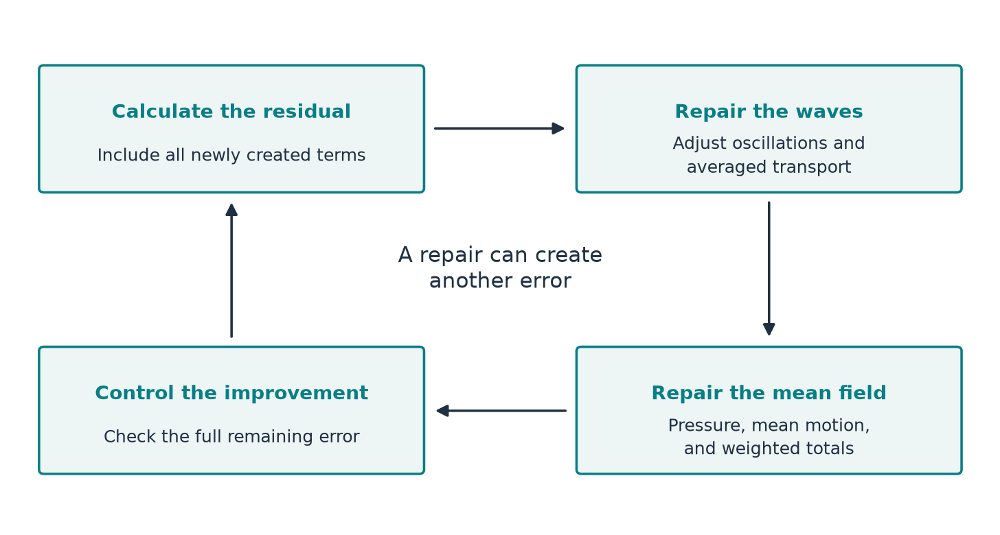

[Start with the paper map](../paper-map/article.html) · Main route, article 9 of 9

We now have the main pieces: a shrinking vortex, a calculation of its missing transport, and small waves that supply the leading contribution. Why does the paper still need several long sections?

Because a successful local repair is not automatically a successful whole construction. Waves interact. Turning a field on or off creates new terms. A small mismatch can change rapidly. An infinite list of corrections may fail to add up to the kind of solution being claimed.

This article explains the finishing work in Sections 5–10. We will use ordinary ideas—separate workspaces, a running account, a convergent sum, and a gentle transition—to see what those sections achieve.

## First distinguish two kinds of repair

The basic vortex is built by keeping its most important balances near the collapse. Terms that are smaller at first, including effects associated with variation along the axis, still need attention. Section 5 adds background corrections for these neglected balances.

A second task appears after the pulses are added. Their leading averaged transport repairs the large annular mismatch, but their evolution, interactions, and smooth cutoffs leave further errors. Sections 8–9 repair these.

“Correction” therefore does not name one universal operation. Some corrections refine the background; others respond to the oscillatory construction. Both must preserve the main growth of the vortex. [Paper, Sections 3.2–3.4 and 5](https://cdn.openai.com/pdf/32d9f210-8b73-45e0-91bc-82a30aef8a9a/navier-stokes.pdf)

## Give different pulses separate workspaces

Suppose two workers need to use the same narrow corridor. Scheduling them into separate slots removes one kind of collision. It does not solve every problem in the building, but it prevents an avoidable interaction.

Section 6 gives overlapping pulse labels separate regions in an **auxiliary periodic coordinate space**. “Periodic” means that the coordinate wraps around, like a clock face. These are mathematical organizing coordinates, not extra physical dimensions of the fluid.

Why does separation help? If one pulse is zero everywhere another is active, their product is zero. That removes their direct cross interaction. The paper later evaluates the organized fields at the actual space-time coordinates and includes the extra terms generated by that evaluation.

This is more precise than hoping that unrelated waves will average each other away. It makes particular products vanish by construction. Interactions within a pulse label and effects of the changing amplitudes remain in the calculation. [Paper, Section 6 and Section 3.3](https://cdn.openai.com/pdf/32d9f210-8b73-45e0-91bc-82a30aef8a9a/navier-stokes.pdf)

## Keep a running account of every new error

Imagine repairing a table by shortening one leg. The table may become less wobbly, but its height changes. You measure again before making the next adjustment.

The paper follows that discipline. After each correction, it recalculates the complete remaining momentum residual, including the terms created by the correction itself.

Different parts need different tools. The cycle treats oscillating terms, adjustments to the averaged stress, remaining mean motion, and weighted totals that affect pressure and transport. Pressure is reconstructed consistently with the updated field. The [weighted-total article](../d6_moment_correction/article.html) explains one small part of that job.

{#fig-cycle fig-alt="A loop connects calculate all remaining errors, repair waves and average transport, repair mean motion and pressure, restore weighted totals, and calculate again."}

The point is not merely to make a graph of the residual look small. The paper needs estimates showing that each cycle improves its behaviour as the singular point is approached. [Paper, Proposition 9.6 and Figure 6](https://cdn.openai.com/pdf/32d9f210-8b73-45e0-91bc-82a30aef8a9a/navier-stokes.pdf#page=15)

## An infinite sum can be finite

You know an example of infinitely many additions that stay bounded:

$$
\frac12+\frac14+\frac18+\cdots=1.
$$

After the first term, the missing amount is $1/2$. After the next, it is $1/4$. The remaining tail can be bounded, so the sum has a precise meaning.

A sequence of fluid corrections needs its own tail estimates. The geometric series is an analogy for why these estimates matter; the paper's corrections are not literally the numbers above.

The construction also makes later corrections active only in smaller neighbourhoods of the singular point. Away from that point, only finitely many stages are active. Close to it, the estimates control the remaining tails.

This is how infinitely many stages can define an ordinary smooth field at every time before blow-up. One cannot infer the result simply from having computed a few successful stages.

## A small mismatch can still be too rough

Picture a road with shallow but very closely spaced bumps. Its height differs little from a flat road, yet the slope changes rapidly. A car still notices them.

The force in this problem must be smooth through the singular time. A force value approaching zero is not enough if its spatial or time variations behave badly.

The paper's local residual is made *flat* at the singular point: it and each fixed order of its derivatives vanish faster than every fixed power of the concentration scale. In ordinary language, the mismatch must become small with enough control over how it changes.

No new calculation is needed to understand the logical requirement. The hard analysis supplies the quantitative bounds, including the errors from cutting off and combining corrections. [Paper, Section 9.5 and Equation (3.4)](https://cdn.openai.com/pdf/32d9f210-8b73-45e0-91bc-82a30aef8a9a/navier-stokes.pdf)

## Turn the flow on gently and confine it smoothly

An abrupt switch creates a sharp change. That would be a poor way to obtain a smooth force. A **cutoff** is a smooth transition from one to zero, like a dimmer rather than an instantaneous switch.

The construction uses such transitions to make the velocity vanish initially and outside a bounded spatial region. Near the collapsing centre, the cutoff equals one, so it leaves the essential motion intact.

There is a complication. Multiplying a fluid velocity directly by a cutoff generally breaks incompressibility. The paper works with a representation that preserves the “no accumulation of volume” condition when the cutoff is applied, and it retains the resulting extra velocity terms.

You do not need to calculate a vector potential or a curl to understand their job here: they are a construction tool for keeping incompressibility exact while restricting where the flow lives. The extra terms created in the transition region still enter the force calculation.

The exterior flow has good limiting behaviour away from the singular point. That allows these transition-region force terms to remain smooth. Section 10 combines this with the residual estimates near the centre and extends the force beyond the singular time. [Paper, Sections 2.3, 3.5 and 10.1–10.2](https://cdn.openai.com/pdf/32d9f210-8b73-45e0-91bc-82a30aef8a9a/navier-stokes.pdf)

## Return to the promised result

The final argument must keep several claims together: increasing velocity near the chosen point, smoothness before the chosen time, bounded total energy, zero initial velocity, and a smooth force with bounded spatial and temporal support.

The paper also uses a comparison argument: another smooth solution with the same initial data and force, in the stated bounded-energy class, must agree with the constructed flow before the singular time. That connects constructing this flow to the claimed failure of a global smooth continuation in that class.

These are conclusions of the paper's complete estimates. Our cartoons and isolated computations explain the architecture; they do not independently establish the theorem.

## Where this fits in the bigger picture

**The early blocks create the mechanism. The finishing blocks make it compatible with the exact statement the paper is trying to prove.** Scheduling limits selected interactions; repeated repair improves the residual; summation controls the infinitely many stages; localization and extension give the required smooth force.

You can now return to the [paper map](../paper-map/article.html) and attach a purpose to every major section. For the separate question of what a shrinking vortex could mean in a real fluid, continue with [core size and molecular scales](../d1_core_size/article.html). The [source notes](source-notes.md) give the precise locations behind this overview.

