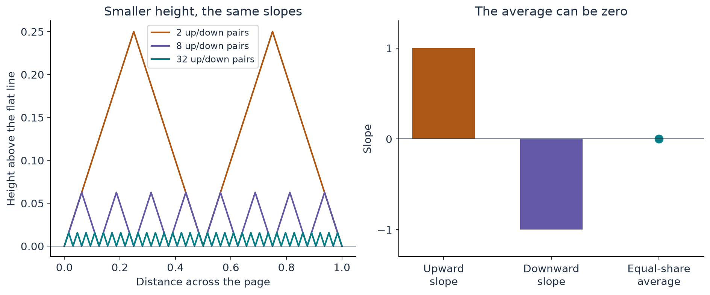

[Start with the paper map](../paper-map/article.html) · Main route, article 5 of 9

Suppose a shape is nearly what you want, but it fails a local rule. Changing the whole shape might ruin everything already built. Could adding very fine detail fix the local rule while keeping the overall shape almost unchanged?

That question leads to a central idea of **convex integration**. It is a way of constructing objects that satisfy difficult local constraints by using carefully arranged fine variations. In fluid problems, the variations can also create a useful averaged momentum transport.

We will begin with slopes and averages, then connect them to two places in the OpenAI paper: preparing the background shear in Appendix C and realizing the missing stress with pulses in Section 7. They share a strategy, but the paper must also make the pulses obey their viscous dynamics.

## A line that looks flat but keeps climbing and descending

Imagine drawing from the left side of a page to the right while following a peculiar rule: every straight segment must have slope $+1$ or $-1$.

A horizontal segment is forbidden. Yet you can go up for a short distance, then down for the same distance, returning to your original height. Repeat this many times. From far away, the zigzag looks almost horizontal.

Slope is just “rise divided by run.” If an upward segment runs right by 0.01 units, it rises by 0.01 units. Its downward partner returns to the original height. Make the segments ten times shorter and the zigzag's height becomes ten times smaller. The slopes remain $+1$ and $-1$.

**The height can be tiny while the local slopes remain substantial.**

{#fig-ripples fig-alt="Coarse and fine triangular zigzags approach a horizontal line; a separate average diagram shows how plus one and minus one give zero."}

The corners need a qualification: the slope is undefined right at each sharp turn. This elementary picture is a piecewise-linear example. Smooth fluid constructions need more carefully designed families and transitions. The picture teaches the separation between a small change in values and a large change in slopes.

## Why the word “convex” appears

Spend half the horizontal distance going up and half going down. The average slope is

$$
\frac12(+1)+\frac12(-1)=0.
$$

Spend three quarters going up and one quarter going down, and the average becomes $0.5$. By changing the proportions, we can obtain any average between $-1$ and $+1$.

The permitted local slopes are the two endpoints. Their *convex hull* is the entire interval between them: all the weighted averages obtained with nonnegative weights that add to one.

This exposes the useful gap. A coarse description might allow an average of zero even though zero is not an allowed local slope. Fine structure can make the local slopes obey their stricter rule while preserving the coarse average.

For this example, “integration” can be understood as building the height by adding up the little rises and falls. The mathematical method extends this idea to much richer constraints. This is an entry point, not its full definition. [De Lellis and Székelyhidi, fluid equations as a differential inclusion](https://arxiv.org/abs/math/0702079)

## Where that idea appears directly in the paper

The background vortex must have suitable **shear**: neighbouring radii must move differently in a way that supports the required pulses. The original joined profile satisfies a weaker set of conditions in part of the annulus, but the waves need stronger local conditions.

Appendix C constructs a smoothly varying periodic family of acceptable shear values. Their average equals the original shear. It then inserts rapid radial variation and adds up its effect to obtain the modified velocity profiles.

The pattern is the one we just met:

- The average supplies the large-scale target.
- Fine variation supplies the stronger local behaviour.
- Adding up the variations makes only a small change to the profile values.
- A separate repair restores the required weighted totals.

The actual constraints involve two coupled shear components, not the two slopes in our sketch. The Appendix C construction also uses a sufficiently large **finite** frequency; it produces a smooth profile. Its role is to make the background compatible with the later waves. [Paper, Appendix C.1–C.2, especially (C.1) and (C.12)](https://cdn.openai.com/pdf/32d9f210-8b73-45e0-91bc-82a30aef8a9a/navier-stokes.pdf#page=158)

This is a particularly direct way to see the convex-integration idea in the paper. It deserves its own explanation, rather than being hidden behind a phrase such as “admissible stress cone.”

## What a “stress cone” is trying to tell us

Think of two ingredients that can be mixed only in nonnegative amounts. Each contributes a particular pair of effects. Their mixtures fill a set of achievable pairs.

That is the elementary meaning of the relevant *cone*: the collection of transport combinations the chosen pulse families can supply. The desired transport must lie inside it. You cannot demand a combination that the available ingredients cannot produce.

The restriction comes from physics and algebra. The weight of a wave's leading quadratic contribution is proportional to its amplitude **squared**, which is nonnegative. The transport directions, however, may contain signed components. Positivity of a weight does not mean all forces point the same way.

Appendix C prepares the background so that its required transport fits the available pulse families. Section 7 then chooses their weights. The background and the waves must be designed together.

## An average velocity can miss a real effect

Take two equal groups with velocity fluctuations $+2$ and $-2$ in one chosen direction. Their mean fluctuation is zero. Their squared fluctuations are both 4, so the mean square is 4.

Thus these two operations give different answers:

$$
(\text{average fluctuation})^2=0,
\qquad
\text{average of fluctuation squared}=4.
$$

Fluid momentum transport contains products of velocity components. As a result, fine motion may disappear from the averaged velocity while still contributing to averaged transport.

This is the bridge from fine structure to fluid stress. It is not enough to say “the ripples are small, so they do nothing.” Their size, spacing, direction, and the quantities being averaged all matter. The [next article](../d4_mean_stress/article.html) works through an actual transport example using two signs and multiplication.

In a fluid convex-integration construction, one commonly begins with an approximate flow and an extra stress describing what remains to be supplied. Fine velocity corrections account for that stress while creating smaller errors to be handled later.

## Why adding arbitrary ripples does not solve Navier–Stokes

The ripples must themselves satisfy fluid constraints. They cannot create or destroy fluid volume, violate the required boundary behaviour, or leave uncontrolled forces behind.

Viscosity makes very short waves especially costly: fine velocity differences are smoothed rapidly. The OpenAI construction therefore includes a specific pulse life cycle. Background shear amplifies a tiny seed; later the changing wave pattern strengthens viscous damping and the pulse fades.

It must also account for the force used to seed the pulses, the small errors introduced when turning them on and off, and interactions with other corrections. Matching an average stress is a vital step, but it leaves all of this work to do. [Paper, Sections 2.2, 6–9](https://cdn.openai.com/pdf/32d9f210-8b73-45e0-91bc-82a30aef8a9a/navier-stokes.pdf)

## The difficult part is controlling what happens in the limit

Imagine reducing a mismatch from 1 to $1/2$, then $1/4$, then $1/8$. That sequence suggests a route to zero. A real construction must prove more: that the corrections combine into a field with the required properties, and that their interactions do not reintroduce a large error.

Fine ripples reveal the danger. Their heights can shrink while their slopes stay large. Their slopes may even change ever more rapidly. Small velocity corrections therefore do not automatically mean small acceleration or viscous terms.

Some classical fluid convex-integration results construct **weak solutions**: solutions understood through balances averaged against smooth probes, without requiring a classical velocity derivative at every point. Buckmaster and Vicol's Navier–Stokes nonuniqueness result belongs to that setting. A weak solution is a mathematical notion, not a synonym for a poorly resolved numerical simulation. [Buckmaster and Vicol](https://arxiv.org/abs/1709.10033)

The target of the paper we are explaining is different: a flow smooth before the singular time and a force that remains smooth through it. Its derivative and summation estimates must establish that stronger time-dependent structure. Calling something “convex integration” does not remove those obligations.

## Where this fits in the bigger picture

There are two related uses of fine structure to remember. **Appendix C changes local shear while preserving the large-scale profile and repairing its totals. The later pulses create the averaged momentum transport needed to repair the background force balance.**

The first prepares suitable conditions for the second. Growth, viscous decay, and repeated correction then make the oscillatory construction work as part of the paper's full argument.

Continue with [zero average, nonzero momentum transport](../d4_mean_stress/article.html), or return to the [paper map](../paper-map/article.html). The [source notes](source-notes.md) distinguish the elementary illustrations, the general convex-integration viewpoint, and the source's specific construction.

