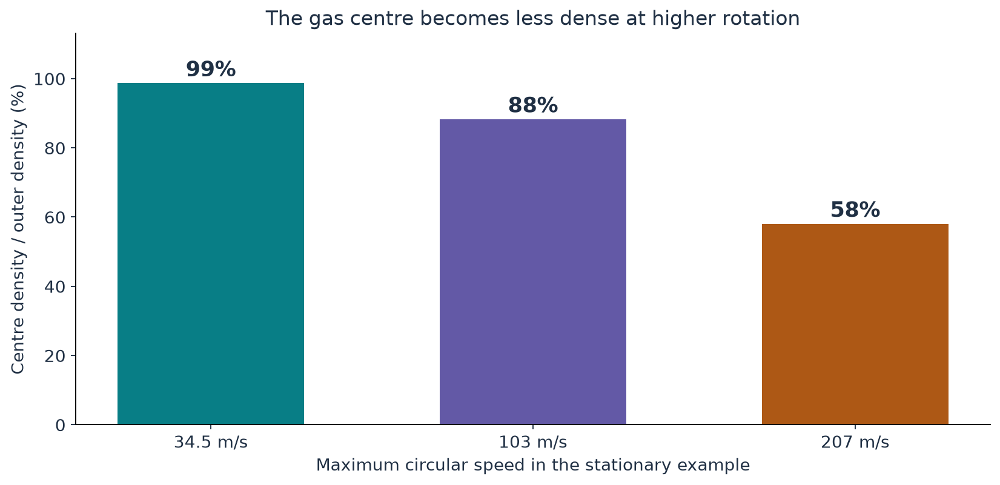

[Return to the paper map](../paper-map/article.html) · Physical interpretation, article 3 of 3

The paper studies an incompressible fluid. In its constant-density setting, pressure adjusts without requiring the density to change.

A real gas responds differently. If its pressure changes substantially, its density and temperature can change too. What would that do to a vortex?

To isolate the idea, our companion study compares two descriptions of the **same prescribed stationary rotation**: one holds density fixed, and the other lets an ideal gas respond. We are asking what a model assumption changes, not simulating the paper's collapse.

## Begin with the inward push again

Fluid travelling in a circle needs an inward acceleration. Higher pressure outside than inside supplies that push.

Faster rotation demands a larger pressure difference. For a fixed radius, doubling the speed makes the required circular acceleration four times as large.

In a constant-density model, pressure can adjust while density stays fixed by assumption. In the gas model, pressure and density are linked by a stated thermodynamic relationship.

Our comparison uses an isentropic ideal-gas relation. That means the model links pressure, density, and temperature with a fixed entropy. You do not need its formula to understand the comparison, but the choice matters to the numerical results.

## Hold the rotating shape fixed

We prescribe a smooth circular-speed profile that is zero on the axis, rises to a maximum, and then decreases outside. Its characteristic radius is one millimetre.

The outer gas state is fixed at the study's room-temperature reference, 23 °C. We change the maximum speed and calculate the pressure and density required for stationary radial balance.

Holding the rotation fixed lets us ask a clean question: what difference comes from allowing density to respond?

It does not tell us how a real vortex would evolve to reach that prescribed rotation. There is no collapse time or changing core radius in this experiment.

## The faster cases have a less dense centre

Here are three representative results. Density is given relative to the outer gas:

| Maximum circular speed | Centre density compared with the outside |
| --- | --- |
| About 34.5 metres per second | About 99% |
| About 103 metres per second | About 88% |
| About 207 metres per second | About 58% |

The results are specific to the chosen speed profile, outer state, and gas law. They are not a universal table for every vortex.

{#fig-density fig-alt="Three bars show approximately 99, 88 and 58 percent centre density for maximum speeds about 34.5, 103 and 207 metres per second."}

At the lower speed, constant density is a close approximation for this measure. At the higher speeds, the same assumption misses a substantial change.

## A tolerance makes “close enough” explicit

Suppose we decide that a five-percent change in centre density is large enough to deserve attention. That is a chosen tolerance, not a law of nature.

In this particular example, the five-percent marker occurs at a maximum speed of about **67 metres per second**.

Using a tolerance makes the question clearer than asking for one universal speed at which incompressibility “breaks.” A different velocity shape, state, or required accuracy can give a different answer.

The supporting calculation also compares pressure predictions. They agree well at low speeds and separate as the gas response becomes stronger.

## Why pressure labels matter

A pressure below an arbitrary mathematical reference can simply be negative in that convention. That is common in incompressible calculations.

Absolute gas pressure has a different interpretation. Once the outer absolute pressure is fixed, a model that demands an inadmissible inner absolute pressure has lost its intended physical interpretation.

The main reader-level point is to keep reference pressure and absolute thermodynamic pressure distinct. A minus sign by itself is not enough to diagnose a physical failure.

## Does this show that compressibility prevents blow-up?

This experiment cannot answer that question. It is stationary, has a fixed radius, and does not evolve the coupled velocity and density in time.

Its useful finding is narrower: allowing density to change alters the pressure-supported equilibrium before molecular dimensions are involved.

It also helps separate the two model questions discussed in the [previous article](../d9_regime_map/article.html). A flow may still have useful continuum scale separation while a constant-density approximation is no longer accurate enough.

The comparison uses a known inviscid equilibrium model. Viscosity and time-dependent dynamics would require a different experiment.

## Where this fits in the bigger picture

**A mathematical construction is tied to its equations and assumptions. Changing the density assumption changes the physical question.** This comparison makes one such change concrete without treating it as a critique of the theorem's internal logic.

It completes the short physical-interpretation route. Return to the [paper map](../paper-map/article.html) to follow the mathematical mechanism.

The [technical article](technical-article.html), [notebook](../../code/d10_compressible_vortex/study.ipynb), and [source notes](source-notes.md) contain the explicit profile, gas law, boundary conditions, and independent numerical checks.
