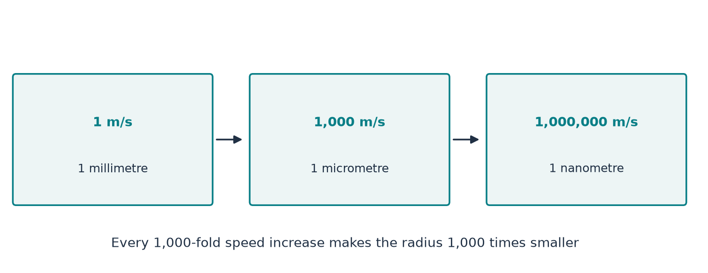

[Return to the paper map](../paper-map/article.html) · Physical interpretation, article 1 of 3

The paper describes a vortex whose intense core becomes smaller while its speed grows. That raises a natural question: by the time the speed is enormous, how much room is left inside the core?

We can make a useful first estimate with a rule close to “ten times faster, ten times smaller.” Then we can compare the answer with familiar lengths: a millimetre, a micrometre, and the spacing between molecules.

The main message is physical. **A formula can be continued into a range where the real-fluid assumptions behind its interpretation have already failed.** Calculating that continuation is useful only if we keep the distinction clear.

## The rule needs one reference size and speed

Speed alone cannot determine a radius. We first need an example point on the size–speed curve.

For illustration, suppose the core has radius **1 millimetre** when its characteristic speed is **1 metre per second**. These values set our example; they are not measured from a realization of the paper's flow.

The paper's leading scaling is very close to an inverse relation:

$$
\text{new radius}\approx
\frac{\text{reference radius}\times\text{reference speed}}
{\text{new speed}}.
$$

So multiplying the speed by ten divides the radius by about ten. The paper has a small exponent adjustment; the inverse rule is its useful limiting approximation for this explanation. [Paper, Section 2.1](https://cdn.openai.com/pdf/32d9f210-8b73-45e0-91bc-82a30aef8a9a/navier-stokes.pdf)

This is a relation between characteristic scales. It is not a calculation of the path of a particular fluid particle.

## Work through the numbers

With our assumed reference pair:

| Characteristic speed | Estimated core radius |
| --- | --- |
| 1 metre per second | 1 millimetre |
| 10 metres per second | 0.1 millimetres |
| 1,000 metres per second | 1 micrometre |
| 1,000,000 metres per second | 1 nanometre |
| About 3,000,000 metres per second | About 0.33 nanometres |

A micrometre is one thousandth of a millimetre. A nanometre is one thousandth of a micrometre.

The last speed is approximately one percent of the speed of light. With the exact value, the supporting calculation gives **0.334 nanometres**. At one tenth of the speed of light, the formal estimate is **0.0334 nanometres**.

The enormous-speed entries are extrapolations of the formula. They do not claim that a real gas or liquid can follow this path.

{#fig-size fig-alt="Cards pair 1 metre per second with 1 millimetre, 1000 metres per second with 1 micrometre, and 1 million metres per second with 1 nanometre."}

## What is wrong with a molecule-sized fluid core?

A continuum-fluid description assigns a smooth velocity to each small region. Physically, that value represents the collective behaviour of many molecules.

The averaging region must meet two requirements. It must include enough molecules to have a meaningful average. It must also be small enough to distinguish nearby parts of the flow.

If the radial structure itself is only about one molecular spacing wide, there is little room to satisfy both requirements. A long core does not fix the problem: many molecules along its length do not provide the missing radial resolution.

For liquid water near room temperature, the estimated mean molecular spacing is about **0.31 nanometres**. Our formal 0.334-nanometre radius is comparable. This spacing is an average separation, not a hard spherical diameter assigned to every molecule.

An atomic reference length, the Bohr radius, is about **0.053 nanometres**. It provides a ruler for comparison, not a universal radius for all atoms. The property sources and definitions are in the [source notes](source-notes.md).

## Important assumptions deserve attention much earlier

Waiting until the radius reaches molecules would miss earlier model questions.

The incompressible description holds density fixed. A common preliminary check compares the fluid speed with the sound speed. When that ratio is no longer small, density changes deserve explicit examination.

For the reference conditions used here, an illustrative speed marker is around **100 metres per second in air**, and around **450 metres per second in water**. On our assumed curve, those correspond to radii of roughly **10 micrometres** and **2 micrometres**—far larger than a molecular spacing.

These are screening markers, not universal failure boundaries. The calculation uses air at 23 °C and 101.3 kPa, and water at 25 °C and 100 kPa. Heating, pressure changes, and other effects can also matter.

In a gas, we must additionally compare the distance molecules travel between collisions with the distance over which the flow changes. That second distance need not equal the overall vortex radius. The [next physical article](../d9_regime_map/article.html) explains why.

## How much do the reference values matter?

They matter directly. If the reference radius were ten times larger while the reference speed stayed fixed, every estimated radius in the table would be ten times larger.

A full dimensional interpretation would also have to match the constructed profile and viscosity to the chosen fluid. That matching has not been done in this scale estimate.

The useful result is therefore a transparent relationship with declared assumptions, not a unique physical radius attached to a given velocity.

## Where this fits in the bigger picture

**This article interprets the paper's shrinking scales; it is not a step that proves or disproves the mathematical construction.** A theorem about a continuum equation and an experiment with molecular matter answer different questions.

The calculation makes the separation visible: the formula reaches molecular sizes only after passing earlier reasons to reconsider the physical model.

Continue with [which small length actually matters](../d9_regime_map/article.html), or return to the [paper map](../paper-map/article.html). The [technical article](technical-article.html), [notebook](../../code/d1_core_size/study.ipynb), and [source notes](source-notes.md) contain the detailed derivation, calibration assumptions, and property references.
