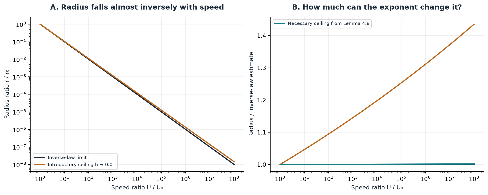
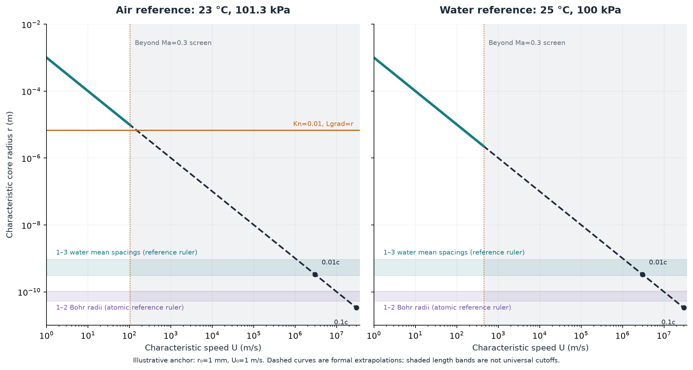
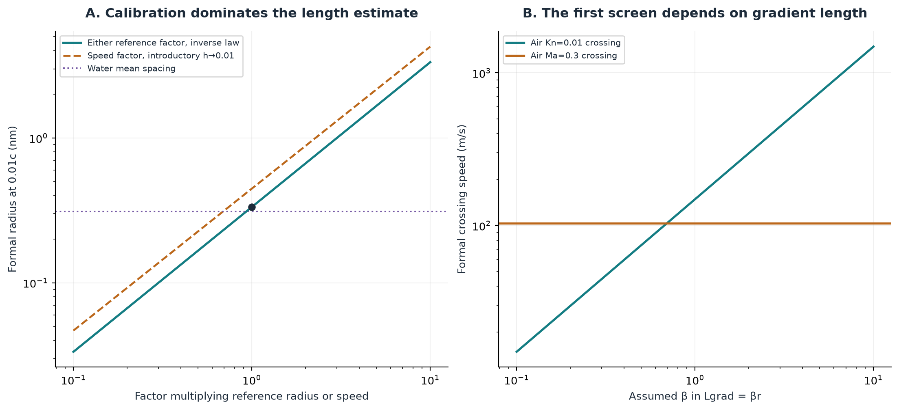

```{python}
#| label: setup
from nscomp.d1 import (
    load_parameters, derived, reference_model, generate,
    speed_table, length_table, fluid_table, gradient_rows, markdown_table,
)
p = load_parameters()
d = derived(p)
model = reference_model(p)
summary = generate()
c = p["constants"]["speed_of_light_m_s"]
```

With an **illustrative** reference radius of 1 millimetre at a characteristic speed of 1 metre per second, the inverse-law estimate puts the core near **`{python} f'{1e9*model.radius(0.01*c):.3f}'` nanometres at one percent of the speed of light**. That is comparable to the spacing between water molecules. But familiar fluid approximations become questionable much earlier in this example, while the core is still micrometres across in radius.

This article derives that estimate, explains its calibration, and asks which physical assumptions should be checked first. It evaluates a leading-order scaling model. It does not simulate a real collapsing fluid or independently verify the proposed proof.

## A shrinking ruler and a growing speed

Imagine a family of curves on graph paper. At each step the horizontal ruler gets smaller while the vertical ruler gets larger. The curves can retain the same shape in their own units even though their physical dimensions change enormously. Similarity variables make this idea precise.

Write $\tau>0$ for nondimensional time remaining. The paper's Section 2.1 gives characteristic scales

$$
r_c\asymp\tau^{1/2},\qquad
U\asymp\tau^{-(1/2+h)},\qquad 0<h<0.01.
$$

Here $U$ is the dominant azimuthal or axial speed scale, rather than the radial inflow speed or angular velocity. The symbol $\asymp$ means comparison up to fixed positive factors. The result concerns a **forced incompressible** flow. [OpenAI, Sections 1–2.1](https://cdn.openai.com/pdf/32d9f210-8b73-45e0-91bc-82a30aef8a9a/navier-stokes.pdf)

For a fixed profile and a consistently defined reference stage, model the normalized scales as

$$
\frac{r_c}{r_0}=\left(\frac{\tau}{\tau_0}\right)^{1/2},
\qquad
\frac{U}{U_0}=\left(\frac{\tau}{\tau_0}\right)^{-(1/2+h)}.
$$

Solving the second relation for time and substituting into the first gives

$$
\boxed{\frac{r_c}{r_0}=\left(\frac{U}{U_0}\right)^{-\alpha}},
\qquad \alpha=\frac{1}{1+2h}.
$$

These equalities define our power-law surrogate; they do not turn the paper's comparison estimates into exact numerical profiles. At a fixed nonzero similarity location, profile factors can cancel in a normalized leading-field ratio. They must still be determined to attach physical units.

The inverse formula is useful too:

$$
U(\ell)=U_0\left(\frac{r_0}{\ell}\right)^{1+2h}.
$$

This gives a **formal** speed at which the surrogate's radius equals a selected length $\ell$. A comparison with a radius should not silently be described as a comparison with a diameter; the latter is $2r_c$.

{#fig-scaling fig-alt="Two plots show radius falling almost inversely with speed and the much smaller exponent effect implied by the detailed parameter hierarchy."}

## Why use the inverse-law limit?

The parameter $h$ is chosen with other construction parameters, not freely fitted. Lemma 4.8, page 35, requires $h<e^{-T_d}$ with $T_d=e^{M_d}+10$. Since $e^{M_d}>0$, a necessary ceiling is $h<e^{-10}$. Other requirements can make it smaller still.

We therefore use **$h\to0^+$**, or $r_c\approx r_0U_0/U$, for the headline calculation. The endpoint $h=0$ is a limiting proxy, not a theorem instance. With the reference pair below, the necessary ceiling changes the radius at $0.01c$ by less than **`{python} f'{100*summary["exponent_ceiling_relative_effect_at_0_01c"]:.3f}'` percent**, holding the anchor fixed. This is an exponent-only bound, not an uncertainty bound on the actual flow. The wider $0<h<0.01$ sweep is retained solely to illustrate sensitivity.

## Putting metres on the axes

Choose $r_0=10^{-3}\,\mathrm m$ and $U_0=1\,\mathrm{m\,s^{-1}}$ at a stage with nonzero velocity. The initially resting state cannot supply that anchor.

To restore units consistently, let

$$
x=L_*\hat x,\quad t=t_*\hat t,\quad
u=\frac{L_*}{t_*}\hat u,\quad
\hat\nu=\nu\frac{t_*}{L_*^2}.
$$

For a construction with $\hat\nu=1$, the unit scales obey $t_*=L_*^2/\nu$. Consequently, a physical reference pair must satisfy

$$
\frac{r_0U_0}{\nu}=\hat r_0\hat U_0.
$$

We have **not** determined the right-hand side from a complete profile. Our millimetre/metre-per-second pair is an illustrative calibration, not a demonstrated realization in air or water. There is also no calibrated time-to-collapse in seconds.

```{python}
#| output: asis
print(speed_table(p))
```

The sonic markers use the reference sound speeds below. The high-speed entries extrapolate far beyond those reference states' applicability. In particular, the calculation predicts neither stable water at these speeds nor an experimentally attainable route to them.

{#fig-physical fig-alt="Radius-versus-speed plots show micrometre-scale Mach screens, an air Knudsen screen, molecular-spacing rulers, and atomic reference rulers. Extreme-speed points lie on formal extrapolations."}

## Which assumption needs attention first?

**Compressibility.** Define $Ma=U/c_s$, with a characteristic speed relative to the vortex's bulk motion. A low-Mach screen near $0.3$ is a useful engineering convention, not a universal transition. For our air reference it is reached near `{python} f'{0.3*d["air_sound_speed_m_s"]:.3g}'` m/s, at a radius near `{python} f'{1e6*model.radius(0.3*d["air_sound_speed_m_s"]):.3g}'` micrometres. The same marker for water occurs near `{python} f'{1e6*model.radius(0.3*p["water"]["sound_speed_m_s"]):.3g}'` micrometres. Cavitation, heating, or other state changes could matter sooner; they are not evaluated here. [Low-Mach modelling discussion](https://ntrs.nasa.gov/api/citations/19960045736/downloads/19960045736.pdf)

**Gas continuum modelling.** A relevant diagnostic is $Kn=\lambda/L_{\rm grad}$. The NIST air reference gives $\lambda=67.3$ nm at 296.15 K and 101.3 kPa, using that study's mean-free-path convention. We assume $L_{\rm grad}=\beta r_c$, with $\beta=1$ as a proxy. A $Kn=0.01$ screen then corresponds to $r_c=6.73$ micrometres and a formal speed near `{python} f'{gradient_rows(p)[1]["kn_screen_speed_m_s"]:.3g}'` m/s. Thus Mach screening comes first **among these two screens under these assumptions**. Taking $\beta=0.1$ reverses their order. [NIST, Equation 11 and Table 3](https://nvlpubs.nist.gov/nistpubs/jres/110/1/j110-1kim.pdf), [NASA discussion of Knudsen screening](https://ntrs.nasa.gov/api/citations/20000004526/downloads/20000004526.pdf)

**Liquids and atomic scales.** For water, estimate the molecular number density as $n=\rho N_A/M$ and the mean spacing as $d=n^{-1/3}$. This gives `{python} f'{1e9*d["water_mean_spacing_m"]:.3f}'` nm. It is a cubic mean-spacing estimate, not a molecular diameter. The atomic ruler is the Bohr radius, approximately `{python} f'{1e9*p["constants"]["bohr_radius_m"]:.4f}'` nm, not the radius of every atom. A local flow description needs an averaging length containing many molecules while remaining small relative to its variation scale. Once those requirements cannot be met, resolving this smooth local vortex as a classical continuum loses its physical basis. [IAPWS Table 8](https://iapws.org/technical-guidance/release/LiquidWater.download), [NIST water molar mass](https://webbook.nist.gov/cgi/cbook.cgi?Name=water), [CODATA constants](https://physics.nist.gov/cuu/Constants/Table/allascii.txt)

```{python}
#| output: asis
print(length_table(p))
```

There is no single universal molecular cutoff. Some averaged transport predictions agree with molecular simulations even at extremely small confinement; that does not establish the validity of every local velocity or stress field. [Gravelle and colleagues](https://arxiv.org/abs/1501.01476)

## What controls the uncertainty?

At fixed speed, the surrogate has logarithmic sensitivities

$$
\frac{\partial\log r_c}{\partial\log r_0}=1,\qquad
\frac{\partial\log r_c}{\partial\log U_0}=\alpha.
$$

A factor of ten in either reference scale changes the inferred radius by approximately a factor of ten. Uncertainty in the radius normalization is mathematically indistinguishable from uncertainty in $r_0$ here; it should not be counted again as an independent error bar.

{#fig-sensitivity fig-alt="Changing the reference calibration moves the molecular-scale prediction substantially. A second panel shows the Knudsen crossing moving across the fixed Mach crossing as the gradient-length proxy changes."}

The property values are frozen reference markers, not a thermodynamic evolution:

```{python}
#| output: asis
print(fluid_table(p))
```

The air density and sound speed use the ideal-gas estimates $\rho=p/(RT)$ and $c_s=\sqrt{\gamma RT}$ with rounded assumptions $R=287.05$ J/(kg K) and $\gamma=1.4$. Viscosities and the water sound speed come from the listed reference tables. [Ideal-gas sound-speed derivation](https://www.grc.nasa.gov/www/k-12/BGP/snddrv.html)

## What this calculation establishes

The algebra explains the nearly inverse radius-speed relation, and the explicit calibration shows how an extreme-speed extrapolation reaches molecular scales. In the example, the displayed Mach and gas continuum screens intervene at much larger radii.

The remaining physical questions include the actual gradient field, pressure and temperature evolution, liquid relaxation times, and the correction pulses' potentially shorter spatial and temporal scales. A collision-time proxy for air can be estimated from $\lambda/\bar v$, but it does not supply the uncomputed strain field. No CFD grid is used, and no conclusion about full-proof validity or dynamical stability follows from these calculations.

The [source and calibration notes](source-notes.md) document the definitions and unresolved quantities. The [executed notebook](../../code/d1_core_size/study.ipynb), [parameter file](../../code/d1_core_size/parameters.json), and [CSV data](../../code/d1_core_size/data/) support reproduction. The next article will explain how a growing velocity can coexist with bounded energy.
