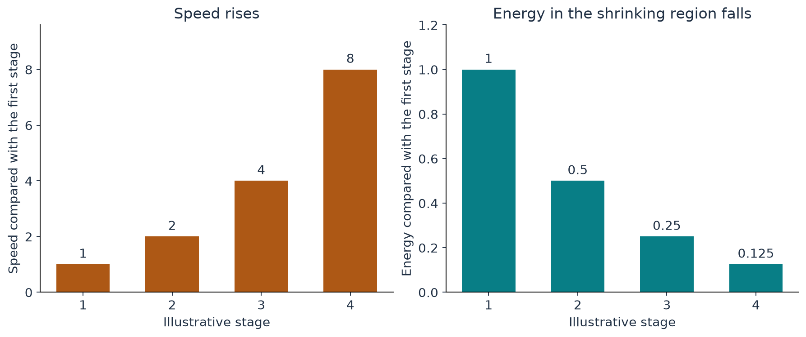

[Start with the paper map](../paper-map/article.html) · Main route, article 1 of 9

If a fluid becomes faster and faster, surely its energy must grow without limit. That sounds reasonable until we ask a second question: **how much fluid is moving at that speed?**

A speeding truck carries much more kinetic energy than a speeding grain of sand. Speed matters, but so does mass. The proposed vortex concentrates its fastest motion into a shrinking region. This makes it possible for the largest speed to rise while the energy in that region falls.

We will use one familiar energy formula and the volume of a box. Those are enough to understand this first building block.

## Start with a small amount of moving material

The kinetic energy of a mass $m$ moving at speed $v$ is

$$
E=\frac12 mv^2.
$$

Doubling the speed multiplies the energy by four, **if the mass stays the same**. But suppose the amount of material moving at that speed becomes one eighth as large. Then the energy changes by a factor of $4/8$, which is one half.

| Quantity | First stage | Next stage |
| --- | --- | --- |
| Mass in the fast region | 1 | 1/8 |
| Typical speed there | 1 | 2 |
| Energy in that region | 1/2 | 1/4 |

These are arbitrary consistent units for an arithmetic example. We are comparing the contents of a region at two stages, not claiming that one material parcel loses seven eighths of its mass.

Repeat the pattern. The speed becomes 4, then 8, then 16. The energy becomes $1/8$, then $1/16$, then $1/32$. There is no contradiction: increasingly fast motion is carried by an increasingly small amount of material.

{#fig-energy fig-alt="A sequence compares rising relative speeds 1, 2, 4 and 8 with falling relative energies 1, one half, one quarter and one eighth."}

## Where the shrinking mass comes from

For a fluid of fixed density, the mass in a region is proportional to its volume. A box half as wide, half as deep, and half as high has one eighth of the original volume.

A cylinder follows the same counting rule when its radius and height are both halved: its circular area becomes one quarter as large, and its height becomes one half as large. Multiply them to get one eighth.

The paper's intense core is approximately a narrowing column. Its radius and axial length both shrink. They do so at slightly different rates, but the basic competition is the one we have just calculated:

**energy in the core depends on shrinking volume times growing speed squared.**

With the paper's chosen rates, the shrinking volume wins. The core's energy tends to zero, even as the characteristic speed grows. The entire flow has other regions, so controlling total energy requires an additional argument. The core calculation explains compatibility; it does not replace that argument. [Paper, Section 2.1 and Section 10.3](https://cdn.openai.com/pdf/32d9f210-8b73-45e0-91bc-82a30aef8a9a/navier-stokes.pdf)

## A high peak is different from a large total

Imagine a crowd viewed from above. “How crowded is the busiest square metre?” and “How many people are in the whole square?” are different questions.

Likewise, the largest fluid speed is a local measure. Total energy adds contributions throughout space. A very high velocity peak confined to a sufficiently small region need not dominate that sum.

This is why an energy bound alone does not automatically provide a bound on the largest speed. A total can stay manageable while one increasingly narrow feature becomes extreme.

The accompanying [animation](animations/core_collapse.html) shows a smooth illustrative bump getting taller and narrower. In a view that continually zooms in and adjusts the velocity scale, its normalized shape stays the same. That is the idea of **self-similarity**: a changing physical pattern can have a stable shape when measured with changing rulers.

The animation is a model of concentration. Its arrows and colours do not track the trajectories of individual molecules.

## Does a shrinking region violate incompressibility?

An incompressible material parcel keeps its volume as it moves. That seems to clash with the shrinking core, until we distinguish the parcel from the region.

Think of the bright spot made by a moving spotlight. The spot is a region defined by a property—being brightly lit. It does not always contain the same people.

The vortex core is similarly a region defined by intense motion and the construction's changing scales. Fluid can enter and leave it. Its shrinking volume therefore does not mean that the same parcel is being compressed into less space.

In the central flow described by the paper, radial inflow is accompanied by axial outflow. The full geometry is more detailed, but the accounting principle remains: fluid does not accumulate merely because motion points inward in one direction.

## Where this fits in the bigger picture

**This block removes an apparent energy contradiction. It does not yet produce a solution of the fluid equations.** A chosen shape can have the right speed and energy behaviour while requiring an unacceptable force.

The paper must next build a smooth vortex profile and make its momentum balance work. Continue with [what happens at the centre](../d6_inner_profile/article.html). For a separate calculation of actual length scales under an assumed reference size, see [core size versus speed](../d1_core_size/article.html).

The [technical article](technical-article.html), [notebook](../../code/d2_finite_energy/study.ipynb), and [source notes](source-notes.md) contain the exact scaling formulas, computational checks, and animation conventions.
