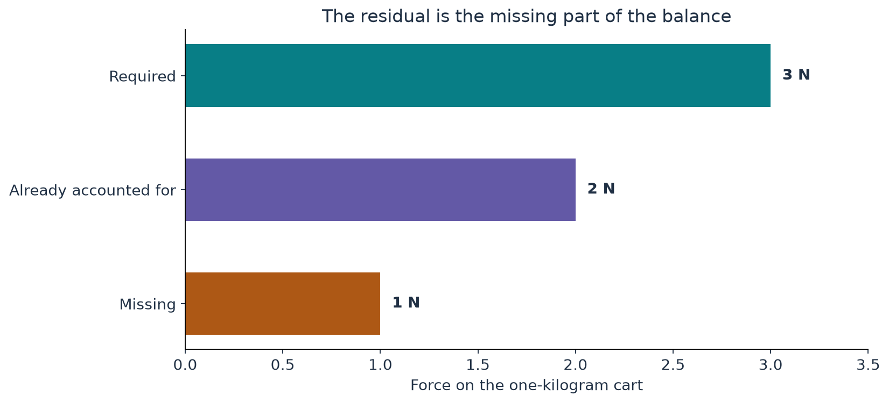

[Start with the paper map](../paper-map/article.html) · Main route, article 4 of 9

We can draw a vortex that gets narrower and faster. We can even arrange its geometry so that the energy stays bounded. But does that motion actually satisfy the fluid equations?

To answer, we calculate the push it would require. The result is called a **residual**. It tells us what is left in the force balance after the chosen velocity and pressure have been inserted.

This is the central question connecting the background vortex to the later oscillations. We will begin with a cart, then translate the same accounting into fluid motion.

## One kilogram, three newtons, and a missing newton

Newton's law says that force equals mass times acceleration. A one-kilogram cart accelerating at three metres per second squared needs a total force of three newtons.

Suppose the forces we have already included add up to two newtons. One newton is missing:

$$
\text{missing push}=3-2=1.
$$

The cart's proposed motion might be perfectly smooth. That does not explain the missing newton. We must supply it or change the motion.

{#fig-balance fig-alt="Bars show a required force of three, an accounted-for force of two, and a missing force of one."}

## The fluid has several contributions to account for

A small parcel of fluid can change its velocity for several reasons.

Pressure differences push it. Viscosity exchanges momentum with neighbouring fluid moving differently. An external force may act. The parcel also moves into new places, where the surrounding velocity may differ from where it began.

That last point is easy to overlook. A car entering a tighter bend changes its motion partly because it has reached a different part of the road. Following a moving parcel is different from watching one fixed point in space.

The Navier–Stokes equation combines these effects. For our purpose, we can read it as a sentence:

> The acceleration of a fluid parcel must match the pressure, viscous, and external contributions.

The paper's momentum residual is the **external force per unit mass required by the chosen velocity and pressure**. If a particular external force has already been specified, subtracting it gives the remaining equation mismatch.

A nonzero residual is therefore not automatically a mistake. A forced solution can have a nonzero required force. What matters here is whether that force has the smoothness and support required by the theorem.

## A constant speed can still require acceleration

Imagine moving around a circle at constant speed. Your direction keeps changing, so your velocity changes. An inward acceleration is required even though the speedometer stays fixed.

This is why a rotating flow needs a pressure balance in the radial direction. A calculation that treats the circular velocity as an ordinary scalar speed and ignores the changing direction misses a real force.

The [pressure article](../d6_axis_pressure/article.html) explained that part of the balance. But satisfying the inward circular balance does not automatically satisfy the balances for changes in speed, axial motion, and viscosity.

A single successful cancellation is one entry in the account, not the whole account.

## Why simply defining a force does not finish the paper

Given a candidate flow, one can formally calculate the force that makes its equation hold. That sounds like an easy way to construct almost any motion.

The important restriction is on the resulting force. The paper requires a smooth force that remains well behaved through the time when the velocity becomes unbounded.

The background vortex alone leaves a troublesome residual in the joining annulus. If that leftover becomes singular, merely naming it “the force” does not meet the target.

The paper therefore changes the velocity itself. Its waves create additional internal momentum transport, chosen to cancel the troublesome leading contribution. Later corrections deal with the rest. [Paper, Section 2.2 and Sections 3.2–3.4](https://cdn.openai.com/pdf/32d9f210-8b73-45e0-91bc-82a30aef8a9a/navier-stokes.pdf)

## Two examples that make the distinction concrete

Our supporting calculation compares an explicit outer flow from the paper with a chosen smooth vortex-shaped example.

The outer flow has a special property: its circulating velocity follows a diffusion equation, and its pressure provides the needed circular acceleration. The relevant momentum residual cancels. The source calls this the *heat exterior* because the smoothing equation is related to the heat equation. This label is about a mathematical form, not a calculation of the fluid's temperature.

The second example has a prescribed shrinking shape and a growing peak. Those features make it useful for explaining concentration. They do not automatically make its force balance work. Its remaining residual exposes that difference.

These calculations show why a convincing animation is insufficient evidence that a field solves the desired equation. We must calculate what force the animation's motion requires.

## Why large terms can still leave a smooth result

Suppose one contribution is 1,000,001 and another subtracts 1,000,000. The result is 1. Individual terms can be large while their combination is small.

The paper relies on carefully organized cancellation of large contributions. The challenge is to keep that cancellation valid as the core shrinks and to control how the remaining force changes in space and time.

A few displayed small numbers cannot establish all of that. But the elementary subtraction explains why a growing velocity and a smooth force are not logically incompatible.

## Where this fits in the bigger picture

**The residual identifies the repair target.** It turns a proposed vortex shape into a concrete question about the transport that is missing.

The next blocks explain how fine structure helps meet local constraints and how oscillating motion supplies averaged transport. Continue with [convex integration, from slopes to fluid motion](../convex-integration/article.html).

The [technical article](technical-article.html), [notebook](../../code/d3_residual/study.ipynb), and [source notes](source-notes.md) contain the actual momentum terms and the two computational examples.
