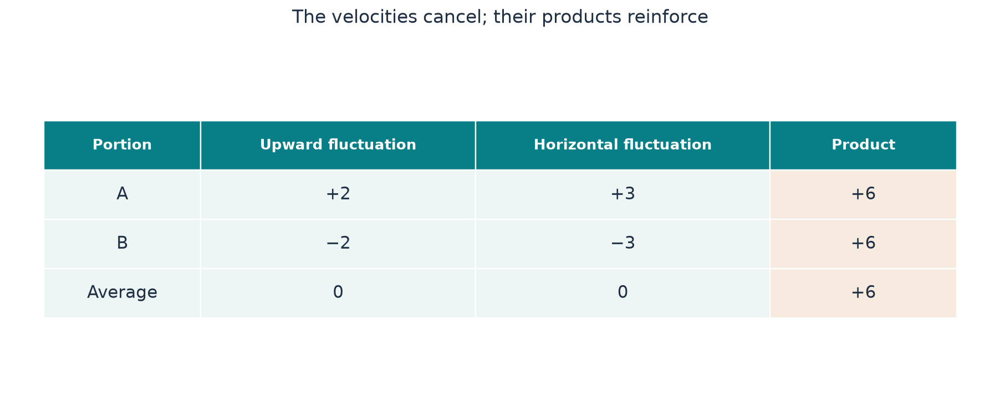

[Start with the paper map](../paper-map/article.html) · Main route, article 6 of 9

Imagine a road between two warehouses. Ten loaded trucks travel north while ten empty trucks return south. The average direction of truck travel can be zero, yet goods have clearly moved north.

Something similar happens in a fluid. Opposite motions need not cancel the quantity they carry. Small-scale velocity variations can have zero average and still produce a useful transport of momentum.

This is the essential reason the paper's oscillations can help its background vortex. We will use signed numbers and multiplication to make the idea precise.

## Velocity and transported cargo answer different questions

Averaging the truck velocities asks about their net movement. Counting transported goods asks how much cargo crosses a boundary and in which direction.

For a fluid, the relevant cargo is **momentum**: mass times velocity. Fluid crossing an imaginary surface carries momentum with it.

This gives a product. One velocity component describes motion across the surface. Another describes the momentum being carried along a chosen direction. For constant density, their product gives the corresponding momentum flux per unit density.

“Flux” simply means an amount passing through a surface per unit area and time. The direction of both the crossing and the transported momentum matters.

## Try the arithmetic with two fluctuations

Suppose equal portions of fluid have the following deviations from their local mean motion:

| Portion | Upward velocity fluctuation | Horizontal velocity fluctuation | Product |
| --- | --- | --- | --- |
| A | +2 | +3 | +6 |
| B | −2 | −3 | +6 |
| Average | 0 | 0 | +6 |

Both velocity fluctuations average to zero. Their product does not.

For portion A, upward motion carries an excess of horizontal momentum. For portion B, downward motion carries a deficit. Relative to the mean flow, these contribute to the same signed transport.

The arithmetic is simply

$$
(+2)(+3)=6,\qquad (-2)(-3)=6.
$$

{#fig-transport fig-alt="Two rows show fluctuations plus two and plus three, then minus two and minus three; both products are plus six."}

A sine wave makes the same point smoothly: its positive and negative parts cancel in the mean, while its square is never negative. The supporting notebook uses sine waves to construct and check this kind of transport.

## Why this averaged transport is called a stress

Different surfaces and momentum directions give different products. Collecting them describes how small-scale motion transports momentum through the fluid.

That collection is often called a **Reynolds stress**, with sign and density conventions that vary between texts. For this explanation, keep the physical meaning: it is the transport contributed by the velocity fluctuations.

You do not need to learn matrix notation to understand its job. The paper especially needs radial transport of circular momentum and radial transport of axial momentum.

The word “radial” means toward or away from the axis. “Axial” means along the axis. Those are two different kinds of cargo carried across rings in the vortex.

## Transport must change from place to place to create a net effect

Imagine a warehouse receiving 100 boxes an hour and sending out 100. Its stock does not change. If it receives 100 and sends out 90, ten boxes accumulate each hour.

Momentum obeys the same accounting. If equal momentum enters and leaves a region, the transport does not change its total. A difference between incoming and outgoing transport produces a net effect.

This is why a nonzero **constant** averaged stress does not by itself accelerate the mean flow. The useful force arises from how the transport changes across space.

The paper shapes the pulse amplitudes and locations so their transport has the required spatial variation. It aims to cancel the troublesome contribution identified by the [residual calculation](../d3_residual/article.html). [Paper, Section 2.2 and Section 3.3](https://cdn.openai.com/pdf/32d9f210-8b73-45e0-91bc-82a30aef8a9a/navier-stokes.pdf)

## Tune the amount with the wave amplitude

If both velocity fluctuations are multiplied by two, their product is multiplied by four. Therefore, changing the wave amplitude changes its quadratic transport strength.

A desired contribution four times as large needs twice the amplitude in this simple scaling. That square-root relationship explains why the paper first finds positive weights for the required stress and then uses their square roots as amplitude factors.

The two pulse families provide different ratios of circular to axial momentum transport. Their nonnegative weights combine those contributions. The desired pair has to be attainable with those families—the “stress cone” condition explained in the [convex-integration article](../convex-integration/article.html).

The paper does not claim that any arbitrary ripple can supply any arbitrary force. Directions, weights, geometry, and evolution must all fit.

## Keep the fluid-volume constraint intact

Simply making a wave stronger in one place can accidentally introduce an apparent accumulation or loss of fluid volume.

The source therefore builds its corrections through a representation that guarantees incompressibility. This introduces some additional, smaller velocity terms. They are retained in the next residual calculation rather than ignored.

Our numerical examples use a related construction to check zero mean, the desired averaged products, and the effect of a spatially changing amplitude. They illustrate the transport mechanism in a simple periodic domain. They are not the actual pulse field of the full vortex.

## Where this fits in the bigger picture

**The oscillations can supply a missing mean transport even though their mean velocity is zero.** This connects fine-scale motion to the large-scale force balance.

That is a central bridge between the convex-integration viewpoint and the paper's pulse construction. But the waves also need a source of energy and a controlled way to fade. Continue with [how a small wave grows and then dies away](../d5_shearing_wave/article.html).

The [technical article](technical-article.html), [notebook](../../code/d4_mean_stress/study.ipynb), and [source notes](source-notes.md) contain the explicit waves, averaging conventions, and computational checks.

