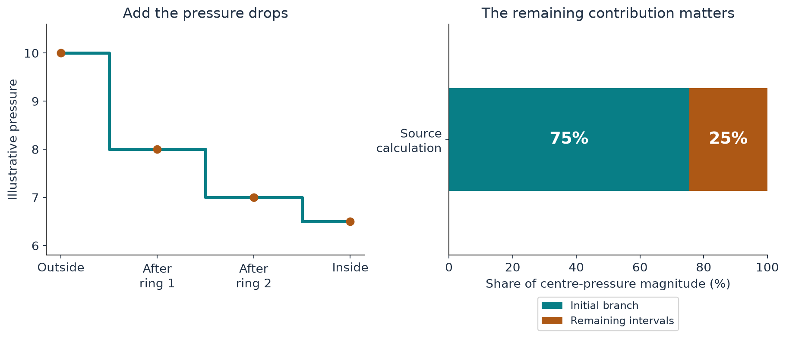

[Start with the paper map](../paper-map/article.html) · Main route, article 3 of 9

Suppose you have built a smooth description of the vortex near its centre. Can you choose a convenient centre pressure and deal with the outer flow later?

In general, no. The surrounding rotating fluid must also be held in circular motion. The pressure differences that provide that inward push connect the outside to the centre.

This article explains that connection without calculating an integral. We will think of pressure changes across successive rings and add them up.

## Going in a circle needs an inward push

A car going around a bend changes direction even if its speedometer reading stays constant. That change of direction requires an inward force.

Fluid going around a vortex needs an inward push too. Pressure is higher farther out and lower farther in, so the pressure difference pushes inward.

For a fixed radius, doubling circular speed makes the required inward acceleration four times as large. The familiar circular-motion formula is

$$
\text{inward acceleration}=\frac{\text{speed}^2}{\text{radius}}.
$$

This tells us why pressure is linked to the rotation rather than being an independent decoration added afterward.

## Build the pressure difference one ring at a time

Picture travelling inward through three rings. Suppose their pressure drops are 2, 1, and 0.5 units. The total drop is $2+1+0.5=3.5$ units.

If the outer pressure is 10 units, the inner pressure must be 6.5 units in this illustration. Leaving out one ring changes the centre value.

| Passage inward | Pressure drop | Pressure after the passage |
| --- | --- | --- |
| Outer ring | 2 | 8 |
| Middle ring | 1 | 7 |
| Inner ring | 0.5 | 6.5 |

These are invented numbers to explain the adding-up operation. In the fluid calculation, the rotation and ring radii determine the contributions.

{#fig-pressure fig-alt="A staircase falls from outer pressure 10 to inner pressure 6.5; a separate contribution bar divides the computed pressure magnitude into approximately 75 percent and 25 percent."}

Using ever thinner rings turns the sum into an **integral**. For this purpose, an integral is a disciplined way to add many small contributions. You do not need to perform that calculation to understand why the pressure depends on the whole radial schedule.

## What the paper fixes at the outside

The paper chooses a reference pressure at radial infinity and calculates the difference inward. This is why its normalized inner pressure can be negative: it lies below the chosen reference.

A negative value relative to that reference is not automatically a claim about negative absolute pressure in an actual gas. The mathematical constant-density equations and a calibrated thermodynamic experiment use pressure differently.

The construction's radial schedule specifies how the outer rotation passes through several regimes. Those regimes contribute to the pressure supplied to the inner problem. The matching is therefore a connection between the outer and inner parts, not a boundary value guessed for convenience. [Paper, Section 3.1 and Appendix A.3–A.4](https://cdn.openai.com/pdf/32d9f210-8b73-45e0-91bc-82a30aef8a9a/navier-stokes.pdf)

## Why later repairs do not force us to start over

A natural worry is that later adjustments to the outer profile will change the pressure we have just calculated.

Some of the paper's corrections are designed to preserve the relevant weighted totals. When a correction preserves the total that determines the centre pressure, that pressure stays the same.

Think of moving items between compartments while keeping the relevant total weight unchanged. The rearrangement matters locally, but an agreed overall quantity is preserved.

This allows the source to calculate the axis pressure from a particular ideal schedule before all its later moment-preserving repairs are assembled. The preservation property is essential; it would not hold for arbitrary modifications. [Paper, Lemma A.5 and Proposition A.7](https://cdn.openai.com/pdf/32d9f210-8b73-45e0-91bc-82a30aef8a9a/navier-stokes.pdf)

## What our computation contributes

The companion calculation adds the schedule's pressure contributions and passes the resulting pressure data to the inner solver.

One useful result is easy to interpret: the schedule's initial branch supplies about **75%** of the centre-pressure magnitude. That is most of it, but treating it as all of it would miss about a quarter.

The code also keeps track of extremely small contributions. Some are too small to change any displayed digit of the total. Recording them separately explains what was included and why discarding them at a given precision would have little numerical effect.

Those implementation details belong in the supporting notebook. The reader-level lesson is the dependency: the inner calculation needs pressure information from the outer construction.

## Where this fits in the bigger picture

**Pressure helps the inner and outer pieces belong to the same flow.** A smooth centre and an attractive exterior do not automatically match; their pressure and weighted totals must fit.

Even after this match, a proposed flow may leave an unacceptable force imbalance. Continue with [the missing push and the momentum residual](../d3_residual/article.html).

The [technical article](technical-article.html), [notebook](../../code/d6_axis_pressure/study.ipynb), and [source notes](source-notes.md) document the source schedule, its pressure calculation, and the remaining construction conditions.

