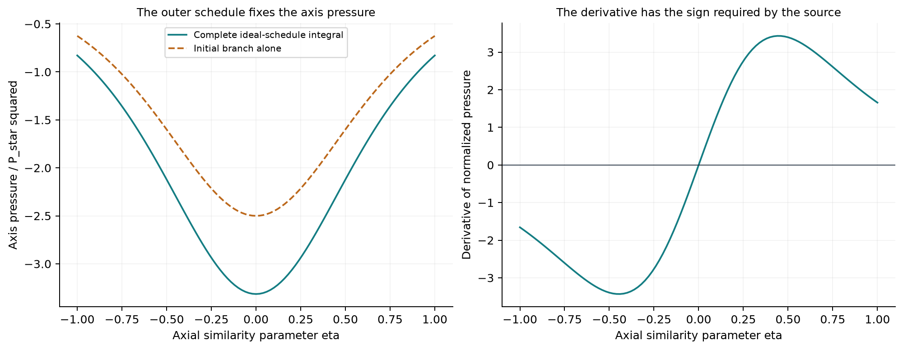

```{python}
#| label: setup
from nscomp.d6c import load_parameters, generate
p = load_parameters()
summary = generate()
```

**Pressure at the vortex axis is constrained by the flow outside it. We now compute that pressure from the paper's prescribed radial schedule and use it in the inner solver. This supplies a missing input; the complete joined flow and its first correction remain unfinished.**

The [previous study](../d6_inner_profile/article.html) built a numerical solver for the leading inner equations. It needed pressure values along the axis, so it began with a clearly declared analytic test function. That was enough to test the recurrence, but it left a physical and mathematical question: where should those pressure values come from in the paper's construction?

In a swirling flow, radial pressure variation supplies centripetal acceleration. Once the pressure is fixed at radial infinity, integrating that balance inward determines the pressure at the axis. We therefore cannot choose the inner pressure and the exterior swirl independently.

This article follows that dependency. We evaluate the source's pressure integral, check it against independent calculations, and pass its axial derivatives to the inner recurrence. The calculation also illustrates two numerical issues that recur in this project: enormous scale ranges and the difference between a small equation defect and an accurate input.

## Pressure remembers the entire radial profile

The leading radial balance is

$$
\Pi_X=\frac{E^2}{2X}.
$$

With pressure normalized to vanish at radial infinity, the axis value is

$$
\Pi_0(\eta)=-\frac12\int_{-\infty}^{\infty}
E_{\mathrm{id,sched}}(y,\eta)^2\,dy,
\qquad y=\log(X/X_R).
$$

Here $X$ is the radial similarity coordinate, $X_R$ is the later joining scale, and $\eta$ is the axial similarity parameter. The logarithmic coordinate removes $X_R$ from the integral. Moving that radial scale therefore does not change the axis-pressure datum.

The source allows this integral to use its ideal azimuthal schedule with certain angular correction bumps omitted: those bumps preserve the total pressure increment. Their interval lengths and all other transitions must still be retained. The later heat replacement also has a compensation that restores the same integral. This lets us compute the datum before implementing every outer correction. [OpenAI, Lemma A.5 and Equations (A.21)–(A.23), pages 133–134; Proposition A.7, pages 139–140](https://cdn.openai.com/pdf/32d9f210-8b73-45e0-91bc-82a30aef8a9a/navier-stokes.pdf)

## Use the source's schedule, with declared numerical choices

The schedule begins with

$$
E=P_*f(\eta)e^{y/10},\qquad
f(\eta)=\frac{1}{1+\eta^2},\qquad y\le0.
$$

That initial branch contributes exactly

$$
\Pi_{0,\mathrm{initial}}=-\frac52P_*^2f^2.
$$

The following intervals change the radial slope, allow the axial flow to decrease, reserve room for moment corrections, remove the azimuthal profile's $\eta$ dependence, and approach the exterior power law. We implement those intervals in their own local logarithmic coordinates. The smooth transitions use the function specified in Equation (A.5). [Appendix A.2, pages 129–130](https://cdn.openai.com/pdf/32d9f210-8b73-45e0-91bc-82a30aef8a9a/navier-stokes.pdf)

For this numerical schedule we choose $M_d=2$, $\lambda=0.02$, $h=10^{-9}$, interpolation length $T_f=100$, and terminal constant $c_o=0.01$. We set $T_d=e^{M_d}+10$ and $\log P_*=T_d+1$. These satisfy the source's displayed scalar inequalities, including $P_*>e^{T_d}$ and $h<e^{-T_d}$.

**They do not certify all the source's “sufficiently large” or “sufficiently small” choices.** In particular, this study does not establish the full stress cone or outer moment construction. The [parameter file](../../code/d6_axis_pressure/parameters.json) records that distinction alongside every numerical choice.

{#fig-pressure fig-alt="The computed axis pressure is negative and even; its derivative is negative for negative eta and positive for positive eta."}

At the center, $\Pi_0(0)/P_*^2\approx$ **`{python} f'{summary["pressure_center_normalized"]:.9f}'`**.

The initial branch supplies about **`{python} f'{100*summary["pressure_initial_branch_fraction"]:.1f}'`%** of its magnitude. Using that branch alone would miss a substantial part of the pressure datum.

## Keep small contributions visible

For these finite choices, the terminal power law starts near $\log_{10}(X/X_R)\approx$ **`{python} f'{summary["tail_start_log10_radius"]:.1f}'`**.

Directly storing that radius as an ordinary floating-point number would overflow. Some late pressure contributions have the opposite problem: they are too small to store directly in binary64 arithmetic.

We avoid both problems by storing logarithmic radius, logarithmic amplitudes, and logarithmic pressure contributions. The initial and infinite final power-law integrals are evaluated analytically. Finite smooth intervals use Gauss–Legendre quadrature.

{#fig-scales fig-alt="The pressure contributions span over 600 orders of magnitude, with several late intervals below the smallest positive binary64 value."}

The infinite exterior tail's normalized pressure contribution has base-10 logarithm **`{python} f'{summary["final_tail_log10_contribution"]:.1f}'`**, or roughly $2\times10^{-630}$ in magnitude. Its contribution beyond an additional logarithmic distance $L$ is that value multiplied by $e^{-(1+2h)L}$. This gives an explicit remainder if a later implementation chooses to truncate the exterior.

Such terms cannot change the displayed digits of the total pressure. Retaining them separately still matters: it distinguishes a quantified small contribution from an integral that was silently omitted. The [contribution table](../../code/d6_axis_pressure/data/pressure_contributions.csv) and [tail data](../../code/d6_axis_pressure/data/exterior_tail.csv) preserve this accounting.

## Check both the integral and its use by the inner solver

Increasing the quadrature order from 128 to 256 changes the normalized pressure by at most about **`{python} f'{summary["baseline_max_pressure_difference"]:.2g}'`** on the declared axial grid. A separate adaptive calculation agrees within its stated tolerance.

There is another check on the radial schedule. Its terminal interval begins only after a source-defined quantity $Q$ reaches a prescribed target. We reproduce that stopping rule and independently integrate its scalar differential equation; the terminal value approaches zero as required. Here $Q$ sets the ideal schedule's interval length. We do not claim to have reconstructed it from all the corrected outer moments.

The pressure dependence on $\eta$ has the form of a positive weighted sum of $(1+\eta^2)^{-\beta}$. Its Taylor coefficients can therefore be generated analytically and handed to the existing inner recurrence. A local calculation at $\eta=0.2$, $Y=1$ uses this pressure, $j=0.02$, $\sigma=10^{-4}$, and $\Lambda=100P_*^2$.

{#fig-convergence fig-alt="Quadrature differences approach binary64 accuracy, and the inner recurrence's leading balance defects decrease with radial degree, with the axial balance reaching roundoff."}

The inner calculation uses 70-digit arithmetic, so its equation defects can become much smaller than the pressure-input uncertainty. Those tiny defects do **not** imply 70-digit accuracy relative to the source's exact pressure integral. Changing the quadrature from 128 to 256 nodes changes the computed axial profile by about **`{python} f'{summary["handoff_quadrature_change"][1]["absolute_change"]:.2g}'`** at the selected point. The [propagated-change table](../../code/d6_axis_pressure/data/handoff_quadrature_change.csv) makes this difference explicit.

## One joining condition now has a sufficient bound

The earlier analytic test data failed condition (B.2), which requires $\chi>0.99$ wherever the axis expression $Z_*$ is sufficiently small. For the present pressure we can use its sign and lower-magnitude bound to confine that region near $\eta=0$.

With the declared threshold $\delta=1$, $|Z_*|\le1$ implies $|\eta|$ is at most about **`{python} f'{summary["B2_eta_band_bound"]:.3g}'`**. Throughout that band, the lower bound on $\chi$ is approximately **`{python} f'{summary["B2_chi_lower"]:.6f}'`**.

The lower bound exceeds $0.99$. The derivation uses the exact initial pressure contribution and the common sign of the remaining pressure terms; it does not rely on sampling a very narrow region and hoping to find its minimum. The [source notes](source-notes.md) give the algebra. [OpenAI, Equation (B.2), page 144, and Equation (A.22), page 133](https://cdn.openai.com/pdf/32d9f210-8b73-45e0-91bc-82a30aef8a9a/navier-stokes.pdf)

This establishes a sufficient bound for that particular condition. The complex-domain amplitude bound, inner exit inequality, outer stress cone, annular moment matching, and first correction remain separate requirements.

We have now replaced the arbitrary pressure test function with a computed, source-defined schedule datum in a local inner calculation. The [executed notebook](../../code/d6_axis_pressure/study.ipynb) reproduces the study, while the [D6 ledger](../d6_moment_correction/implementation-ledger.md) records what is still needed for the full corrected flow.
