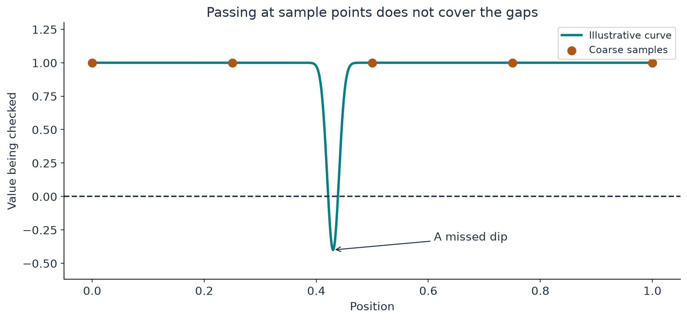

[Return to the paper map](../paper-map/article.html) · Optional mathematical side article

A bridge can look sound where you inspect it and still have a weak section between the inspection points. The same issue appears when we calculate a profile at a finite set of positions.

Our earlier work on the vortex encountered exactly this kind of difficulty. A very narrow parameter interval contained a failed condition that a coarse scan could miss.

This article explains the lesson with a graph and a simple distinction: **a set of successful checks is different from a bound that covers a whole region**.

## A dip can hide between sample points

Imagine checking a road's height every hundred metres. All the measured heights are positive. Does that prove the road never dips below a particular level?

No. A short dip could sit between two measurements. More samples help only if they reach the troublesome scale or are combined with information about how fast the road can change.

{#fig-sampling fig-alt="A smooth curve contains a narrow negative dip near the middle; five widely spaced sample markers all remain positive."}

The graph does not show the paper's vortex. It makes one logical point visible: values at selected positions do not by themselves determine what happens everywhere else.

## The vortex has conditions at its outer edge

The inner profile must do more than satisfy its local equations. At its outer edge, it needs the right shear and related inequalities so the later construction can continue.

Here “edge” is the boundary of the inner calculation, not the boundary of all the fluid. The joining annulus and exterior lie beyond it.

Our calculation therefore asked two different questions. Does the local profile solve the leading equations accurately? And does it reach a state suitable for the next construction step?

A “yes” to the first question does not force a “yes” to the second.

## What the narrow interval taught us

For one of our finite parameter choices, a targeted scan found negative angular shear in a narrow band. Increasing the accuracy and the number of radial coefficients preserved the failure.

Choosing a larger scale parameter recovered the required signs at the declared points. That supports those numerical observations. It does not certify the condition between all the points.

The scale of the successful fine scan was striking: all 19 distinct high-precision coordinates became the **same stored value** when converted to ordinary double-precision numbers.

Asking a computer to evaluate 19 inputs is not really 19 different checks if the computer has already rounded all the inputs to one value. This is why the [article about computer digits](../d7_conditioning/article.html) matters.

The tiny width here is dimensionless. It is not a molecular size in a physical fluid.

## A bound answers a different question

Suppose we know the highest possible speed at which a road can rise or fall over each stretch. Together with sampled heights, that information may rule out a hidden deep dip.

More generally, a **bound** controls all allowed cases in a stated region. It does not depend on happening to sample the worst point.

The study also constructed a conservative analytic bound for the axis amplitude over a specified mathematical neighbourhood. That bound has a broader scope than the sampled exit checks.

The source uses complex-variable estimates to control the profiles and their derivatives. Those details are in the technical article. The distinction to keep here is about coverage: a bound throughout a region versus measurements at selected coordinates. [Paper, Appendix B, especially (B.16)–(B.19)](https://cdn.openai.com/pdf/32d9f210-8b73-45e0-91bc-82a30aef8a9a/navier-stokes.pdf)

## Why very large numbers need a different representation

One amplitude depends on an exponential. Writing the enormous normalization as an ordinary number is impractical.

We instead store its logarithm. If a quantity is $10^{1000}$, storing the exponent 1000 can be much more convenient than writing a one followed by a thousand zeros. Logarithms also turn multiplication into addition.

The actual calculation uses natural logarithms and extra arithmetic precision. You do not need those details to see why changing the representation helps.

## Where this fits in the bigger picture

**This side study explains why reliable local calculations and global construction conditions are separate tasks.** It supports the inner-profile preparation in Appendix B, before the final joined field is assembled.

It is optional on a first reading of the mechanism. Return to the [paper map](../paper-map/article.html), or follow the main story into [convex integration and shear preparation](../convex-integration/article.html).

The [technical article](technical-article.html), [notebook](../../code/d6_global_axis/study.ipynb), and [source notes](source-notes.md) retain the actual parameter choices, analytic bound, and numerical checks. The full joined/corrected flow was not computed in this study.
