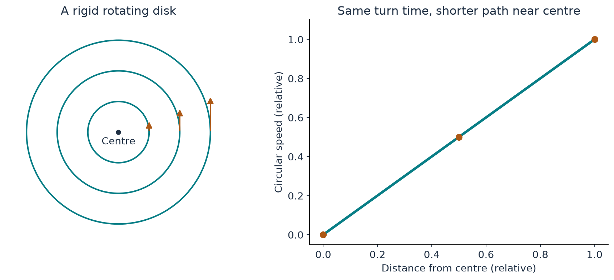

[Start with the paper map](../paper-map/article.html) · Main route, article 2 of 9

A drawing of a whirlpool often shows arrows circling a central point. But what should an arrow right at that point do? There is no single “around the centre” direction there.

That small question reveals a major requirement of the construction. The fluid must be perfectly smooth at every time before the designated singular time. We cannot build the final blow-up by putting a hidden defect at the centre from the start.

This article explains how the paper begins with a regular inner profile. The key ideas are the circumference of a circle, a smooth graph, and an approximation that improves as more shape information is included.

## Use a roundabout as the first picture

Imagine dots painted on a rigid rotating disk. Every dot completes one turn in the same time. A dot farther from the centre travels a longer circle, so it moves faster.

The circumference is $2\pi r$, where $r$ is the distance from the centre. With a common rotation period, the speed is proportional to $r$. A dot halfway out moves half as fast. At the very centre, its circular speed is zero.

This does not describe the whole vortex in the paper. It gives a simple model of regular behaviour near a rotation axis: the circulating speed can vanish smoothly even while the rotation is strong.

{#fig-centre fig-alt="Concentric circles accompany a straight line showing circular speed increasing from zero with distance from the centre."}

Fluid can still move **along** the axis. Zero circular speed at the centre does not require the full velocity to be zero.

## Describe the shape before changing its size

A **profile** is simply a graph describing how a quantity varies with position. Here we need profiles for circular motion, axial motion, and pressure.

The construction separates the profile from its changing physical scales. Imagine printing the same picture at different sizes and changing the colour scale used for speed. The profile describes the underlying picture; the time-dependent scales describe how narrow and fast it becomes.

This separation helps organize the equations. A shrinking coordinate ruler follows the core, so the profile does not have to be recomputed as an unrelated picture at every time.

The actual radial and axial rulers change at slightly different rates. For this first explanation, remembering that there are two rulers is more useful than memorizing their exponents.

## Let the equations determine the nearby shape

Suppose we know a smooth graph's value at a point. To draw it nearby, we might first use a constant value, then add a tilt, then add curvature.

An elementary example is

$$
y=1+x+x^2.
$$

At $x=0.1$, its three terms are $1$, $0.1$, and $0.01$. This illustrates how powers can organize information close to the starting point. It is not the vortex formula.

The inner solver uses this general idea. It represents the unknown radial profiles by powers of the radial coordinate. The fluid equations relate the coefficients, so the nearby shape is constrained by the balance of motion, pressure, and viscosity.

Including more coefficients gives a way to check whether the approximation is settling down. If successive approximations agree better over a declared region, that is useful numerical evidence. It is not automatically a guarantee beyond that region.

In the paper, Appendix B supplies analytic existence and continuation arguments. Our numerical study illustrates how a local coefficient construction behaves for stated inputs. [Paper, Section 4 and Appendix B](https://cdn.openai.com/pdf/32d9f210-8b73-45e0-91bc-82a30aef8a9a/navier-stokes.pdf)

## Why the upward and downward motions are not perfectly symmetric

A perfectly symmetric sketch is attractive, but it can make two useful mechanisms weak in the same place.

The paper needs enough shear near the edge of the inner flow to amplify the later pulses. Circular shear helps in much of the region; axial shear supplies another contribution. A small axial bias separates locations where those mechanisms would otherwise both become ineffective.

Think of arranging two supports so their weak spots do not line up. The analogy explains the design choice; the actual condition is a quantitative statement about the velocity profiles.

This is one reason the flow cannot be specified by “draw a nice symmetrical whirlpool.” Its shape is chosen to support later steps of the argument. [Paper, Section 2.1](https://cdn.openai.com/pdf/32d9f210-8b73-45e0-91bc-82a30aef8a9a/navier-stokes.pdf#page=5)

## A local profile still needs a connection to the outside

A good centre is one piece of the construction. The profile must extend far enough, reach a suitable state at its outer edge, and connect to the annulus and exterior.

Pressure is especially important. We cannot choose its inner value arbitrarily and assume that the surrounding rotating fluid will fit it.

Our first inner calculation used declared test pressure data to check the numerical method. That was a useful component check. It was not an assembled version of the paper's entire vortex.

The next stage supplied pressure from the source's outer schedule. The distinction is similar to testing a bridge component in a workshop before calculating the loads it will carry in the actual bridge.

## Where this fits in the bigger picture

**The smooth inner profile gives the concentrating vortex a legitimate starting shape before the singular time.** Its edge must also provide the shear needed by the later wave mechanism.

The growth of the final maximum speed comes from the evolving concentration, not an initially broken rotation axis. Continue with [why the centre pressure depends on the outside](../d6_axis_pressure/article.html).

The [technical article](technical-article.html), [notebook](../../code/d6_inner_profile/study.ipynb), and [source notes](source-notes.md) give the coupled equations, numerical convergence checks, and limits of the local calculation.
