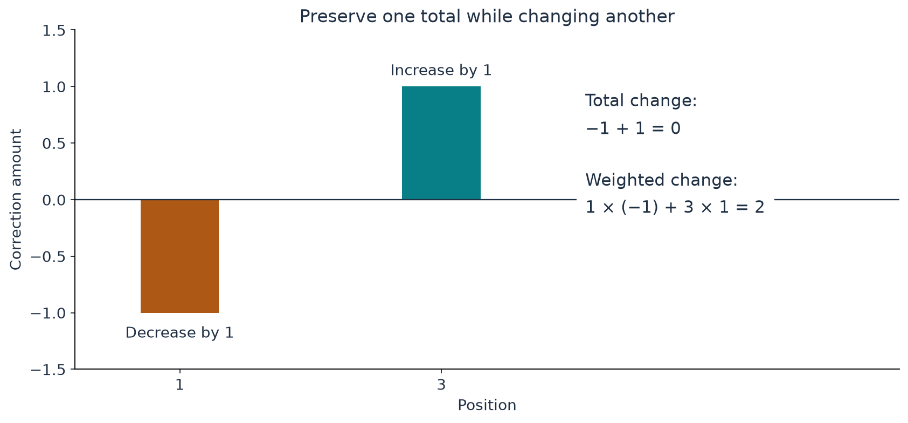

[Start with the paper map](../paper-map/article.html) · Main route, article 8 of 9

Suppose you adjust a small part of a velocity profile to fix its local behaviour. Why should a distant part of the flow care?

Because some quantities are determined by totals accumulated across the profile. Pressure and momentum constructions can depend on such totals. A local change can therefore leave an unwanted effect outside the region you meant to modify.

The paper uses carefully placed local adjustments to repair these totals. The basic idea can be understood with sums and the balance of a ruler.

## A total and a weighted total are different

Put equal small weights at different places on a ruler. Their total mass tells you how heavy the ruler's load is. Their distances from the pivot determine its turning effect.

A **moment** is a total in which position, or another specified factor, supplies a weight. You already know a moment from the seesaw rule: weight multiplied by distance from the pivot.

For the fluid profiles, the weights are mathematical functions of radius. There are several totals to preserve. The principle is the same: knowing the plain sum does not tell you every weighted sum.

## Two small adjustments can do two different jobs

Consider two correction amounts, one at position 1 and one at position 3. Remove one unit at the first position and add one unit at the second.

The total change is zero:

$$
-1+1=0.
$$

The position-weighted change is two:

$$
1(-1)+3(1)=2.
$$

We have changed a moment while preserving the ordinary total.

{#fig-moments fig-alt="Two correction bars at positions one and three have heights minus one and plus one; labels show zero total change and weighted change two."}

More generally, if the two amounts are called $a$ and $b$, we can choose them by solving

$$
a+b=0,\qquad a+3b=2.
$$

Subtract the first equation from the second: $2b=2$, so $b=1$ and $a=-1$. This is the entire algebra behind our example.

## Replace point adjustments with smooth patches

A real fluid correction cannot be a sharp spike with a discontinuous edge. The paper uses smooth, localized patches.

Imagine a small hill-shaped graph that starts at zero, rises smoothly, and returns smoothly to zero. Multiply it by a positive number to add a local bump or by a negative number to make a local decrease.

Place several such patches in reserved intervals. Each patch changes the required weighted totals by calculable amounts. Its coefficient becomes a control knob.

The patches should affect the totals in sufficiently independent ways. Two knobs that always produce exactly the same combination of changes would not let us control two independent targets.

That is the practical meaning of solving an invertible small system in this part of the proof.

## Why matching these totals keeps the repair local

Suppose an outer quantity is obtained by adding contributions from the centre outward. A local correction with nonzero accumulated total may leave a constant offset after its own support has ended.

The correction is locally supported, but the quantity reconstructed from its cumulative effect is not.

Making the relevant weighted totals vanish removes these tails. This allows pressure and velocity corrections to remain confined to their intended regions and makes the matching to the exterior work.

The same general technique appears at several points in the paper: preparing the profiles, restoring totals after the rapid shear changes of Appendix C, and correcting mean-flow compatibility conditions later. The exact totals differ between these tasks. [Paper, Appendices A and C, Section 5, and Section 8.6](https://cdn.openai.com/pdf/32d9f210-8b73-45e0-91bc-82a30aef8a9a/navier-stokes.pdf)

## What our five-control experiment does

The companion implements a particular five-moment repair from Section 5. It uses two axial patches and three angular patches, then chooses their coefficients to cancel five supplied discrepancies.

“Axial” refers to motion along the vortex axis; “angular” refers to motion around it. The actual weights are more complicated than positions 1 and 3 on our ruler, but the logical operation is the same.

The computation checks the weighted totals again after applying the patches. In the declared test, the remaining discrepancies are near ordinary floating-point precision.

The supplied discrepancies are test inputs. They were not measured from a completed first correction of the full joined vortex. The experiment demonstrates this repair tool, not a full before-and-after Navier–Stokes residual calculation.

Signed profile corrections should also not be confused with the nonnegative squared amplitudes used to weight the leading pulse families. They serve different jobs.

## Why this part of the proof is easy to underestimate

The large waves and shrinking vortex attract attention. Weighted totals can look like bookkeeping.

But a profile may look excellent locally and still fail to match its outside because a small integrated discrepancy remains. Local plots alone can miss that problem.

The repair step makes a local modification compatible with global requirements. It is part of what turns a collection of plausible pieces into a candidate whole.

## Where this fits in the bigger picture

**Moments are the connection checks between local repairs and the rest of the flow.** A handful of well-placed smooth patches can restore the required totals while keeping their effects confined.

We now have the main tools needed to understand the final construction cycle. Continue with [how the pieces become one complete flow](../completing-the-flow/article.html).

The [technical article](technical-article.html), [notebook](../../code/d6_moment_correction/study.ipynb), and [source notes](source-notes.md) identify the precise five constraints and their numerical checks.

