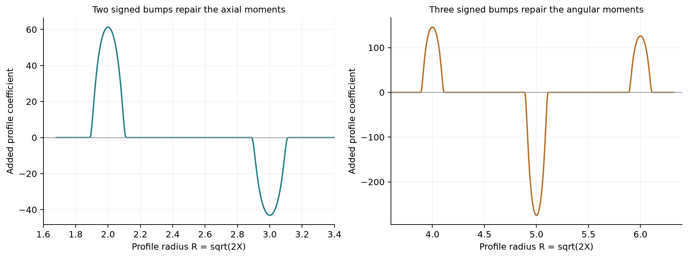

```{python}
#| label: setup
from nscomp.d6 import load_parameters, generate
p = load_parameters()
summary = generate()
```

**A correction confined to a small region can still leave an unwanted effect outside that region. Weighted integrals determine whether those exterior tails disappear.** This installment shows how five localized adjustments can cancel five prescribed integral discrepancies.

The previous articles made the momentum residual and oscillatory transport concrete. We now return to a specific correction step in the paper. Its positive-order axisymmetric profiles must preserve integral constraints when extended away from the axis. Equations (5.14)–(5.16) repair those constraints using two axial bumps and three angular bumps. [OpenAI, Lemma 5.2, pages 50–52](https://cdn.openai.com/pdf/32d9f210-8b73-45e0-91bc-82a30aef8a9a/navier-stokes.pdf)

We implement that finite solve, choose explicit smooth bumps, and verify the corrected integrals with separate quadrature. The five input discrepancies are prescribed test values. They have **not** been computed from a reconstructed inner solution, so this is stage A of D6: a source-defined substep, rather than a completed order-one momentum correction.

## Why does a local change leave a distant tail?

Consider the simple relation

$$
F(R)=\int_0^R g(s)\,ds,
$$

where $g$ vanishes outside a bounded interval. Beyond that interval, $F$ becomes constant. It becomes zero there only if the **total integral of $g$ is zero**.

Adding a compactly supported $g$ therefore does not automatically give a compactly supported $F$. An integral condition is needed.

The same issue occurs in the correction construction. Reconstructing radial velocity, pressure, and stress requires integration. Five moments are imposed so that those reconstructed quantities have the required exterior behavior. The two integrated stress conditions use cylindrical radial weights. [OpenAI, Equations (5.9)–(5.12)](https://cdn.openai.com/pdf/32d9f210-8b73-45e0-91bc-82a30aef8a9a/navier-stokes.pdf)

We can understand and test the finite moment solve before evaluating the entire flow.

## Five controls for five discrepancies

Let $R=\sqrt{2X}$ denote the dimensionless profile radius. Add two compact bumps to the axial coefficient $U_n$ and three to the angular coefficient $E_n$:

$$
\delta U_n=\alpha_1b^U_1+\alpha_2b^U_2,\qquad
\delta E_n=\beta_1b^E_1+\beta_2b^E_2+\beta_3b^E_3.
$$

The bumps are nonnegative, have unit integral, and occupy disjoint radial intervals. Their coefficients may have either sign. These are signed corrections to velocity profiles, rather than the nonnegative squared wave amplitudes used for covariance matching in D4.

Our explicit bump centered at $c$ has halfwidth $w$:

$$
b(R)=
\begin{cases}
\displaystyle\frac1{wZ}
\exp\!\left[-\frac1{1-((R-c)/w)^2}\right],&|R-c|<w,\\
0,&|R-c|\ge w,
\end{cases}
$$

where $Z$ normalizes its integral. The bump and all its derivatives vanish at the edges. We use centers $2,3$ for the axial bumps and $4,5,6$ for the angular bumps, with halfwidth $0.12$. These are representative positive profile radii; they have not been located inside the actual paper annulus.

## The required coefficients come from two small systems

The reserved patch has the source form $U_0=0$ and $E_0=e_*f(\eta)R^{-1-2\lambda}$. This makes the moment response split into two blocks:

$$
(B_U)_{ij}=\int_0^\infty R^{p_i}b^U_j(R)\,dR,
\qquad (p_1,p_2)=(1,1-2\lambda),
$$

$$
(B_E)_{ij}=\int_0^\infty R^{s_i}b^E_j(R)\,dR,
\qquad (s_1,s_2,s_3)=(2,-2-2\lambda,-2\lambda).
$$

For scaled discrepancies $\mathbf d_U,\mathbf d_E$, the repair is

$$
B_U\boldsymbol\alpha=-\mathbf d_U,\qquad
B_E\boldsymbol\beta=-\mathbf d_E.
$$

These are the two systems in Equation (5.16). [OpenAI, pages 51–52](https://cdn.openai.com/pdf/32d9f210-8b73-45e0-91bc-82a30aef8a9a/navier-stokes.pdf)

We solve the systems directly rather than explicitly forming matrix inverses. The baseline uses $\lambda=0.1$,

$$
\mathbf d_U=(1,-0.4),\qquad
\mathbf d_E=(0.3,-0.2,0.1).
$$

The parameter $\lambda$ here controls the reserved-patch power law. It is distinct from the expansion-order notation $\lambda_n=2nh$.

{#fig-profiles fig-alt="Two axial bumps and three angular bumps, with positive and negative coefficients, occupy disjoint intervals."}

## Check the integrals after applying the correction

A small linear-system residual is useful, but it only checks consistency with the matrix that was supplied to the solver. If the matrix integrals are inaccurate, that solve can still give the wrong correction.

We therefore calculate the baseline matrix with quadrature order 96 and evaluate the resulting moments again with order 384. The tests also integrate the bump-weight products independently using adaptive quadrature, including the pressure and momentum-flux factors from the reserved patch.

For $e_*f=1$, the original five moments corresponding to our inputs are

$$
(m_1,m_2,m_3,m_4,m_5)=(1,0.3,-0.4,-0.4,-0.1).
$$

Each plotted remainder is divided by that moment's own initial magnitude. This avoids combining moments with different weights into an unexplained single norm.

{#fig-moments fig-alt="Five normalized moment discrepancies fall from one to near floating-point precision, with a separate quadrature-refinement check."}

The largest absolute moment remainder is approximately **`{python} f'{summary["maximum_absolute_moment_remainder"]:.2g}'`**. The largest componentwise relative remainder is **`{python} f'{summary["maximum_relative_moment_remainder"]:.2g}'`**.

This verifies the selected integral repair for the declared inputs. It does not verify the differential equations satisfied by an entire corrected background.

## An invertible system can still be difficult to compute

The axial weights are $R$ and $R^{1-2\lambda}$. As $\lambda$ decreases toward zero, these two functions become nearly identical. The two rows of $B_U$ then become nearly dependent.

That has two separate consequences for our fixed test discrepancies. The coefficients needed to satisfy both constraints become large, and numerical errors in the moments become more strongly amplified.

{#fig-conditioning fig-alt="As lambda approaches zero, the axial matrix condition number and correction coefficients grow, and moment cancellation loses digits."}

At $\lambda=10^{-8}$, the axial condition number is about **`{python} f'{summary["smallest_lambda_condition_U"]:.2g}'`**, and the largest relative moment remainder is approximately **`{python} f'{summary["smallest_lambda_relative_moment_remainder"]:.2g}'`** in this implementation.

Condition numbers depend on the chosen coordinates and scaling. The data therefore also include the axial condition number after normalizing each matrix row. Its deterioration persists because the rows are becoming parallel.

The scan keeps the prescribed discrepancies fixed while changing $\lambda$. It does not construct a corresponding family of full paper profiles. In particular, it establishes no instability of the proposed Navier–Stokes solution. It identifies a numerical issue to check when an actual profile supplies these discrepancies.

## What is still needed for a full correction comparison?

The finite repair is ready to accept discrepancies from a future profile calculation. The missing work lies upstream:

1. Evaluate one joined leading profile, including its inner, annular, and exterior regions and the selected construction constants.
2. Solve the coupled first inner coefficient equations for the angular velocity, axial velocity, and pressure.
3. Extend that inner coefficient, compute its five actual discrepancies, and pass them to this repair.
4. Reconstruct the complete corrected fields and compare their momentum residuals on resolved physical-coordinate samples.

The [implementation ledger](implementation-ledger.md) lists the source definitions and current status of those dependencies. The published formalization repository was also inventoried; that check found Lean source, but no Python/Julia/notebook or tabulated-profile files of the inspected types. It was not a proof audit.

The numerical result here is a working, independently checked component of the correction machinery. A reduction in these five integral remainders must remain separate from the still-uncomputed reduction in the full momentum residual.

The [notebook](../../code/d6_moment_correction/study.ipynb), [parameters](../../code/d6_moment_correction/parameters.json), and [CSV data](../../code/d6_moment_correction/data/) expose all inputs, coefficients, and checks.
