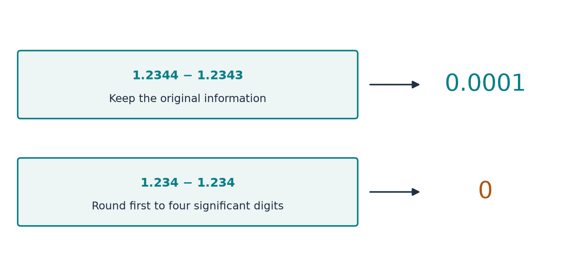

[Return to the paper map](../paper-map/article.html) · Optional numerical side article

A computer can perform a calculation exactly as instructed and still produce a misleading answer. One reason is that it stores only a finite number of digits.

That matters in this project because the construction repeatedly cancels quantities. When the desired answer is a small difference between large, nearly equal contributions, the digits that look least important can determine the entire result.

We will use subtraction and two elementary equations to separate two problems: loss of information during calculation and sensitivity already present in the problem.

## Subtract first, or round first?

Take the numbers 1.2344 and 1.2343. Their difference is 0.0001.

Now keep only four significant digits before subtracting. Both become 1.234, and their stored difference becomes zero.

| Operation | Result |
| --- | --- |
| Subtract the original numbers | 0.0001 |
| Round each number first | 1.234 and 1.234 |
| Subtract the rounded numbers | 0 |

The subtraction is not faulty. The needed information was lost before it began.

{#fig-rounding fig-alt="Original values 1.2344 and 1.2343 yield 0.0001; rounded values 1.234 and 1.234 yield zero."}

The same issue appears when large correction terms are designed to cancel. A coefficient can look accurate to many digits while still lacking the particular digits needed for the final small remainder.

## A better formula can avoid losing the difference

Two formulas can mean exactly the same thing in algebra but behave differently with rounded numbers.

Suppose one formula first builds two nearly equal quantities and subtracts them. Another calculates their small difference more directly. The second may preserve information that the first discards.

The supporting study uses such a reformulation for two nearly identical moment weights. It also uses higher-precision arithmetic where needed.

These are improvements in how we evaluate the same mathematical problem. They do not alter the intended correction or create new fluid physics.

## Some problems are sensitive even with perfect arithmetic

Consider

$$
x+y=2,\qquad x+1.000001y=2.000001.
$$

Subtract the first equation from the second. We get $0.000001y=0.000001$, so $y=1$ and $x=1$.

Now change only the second right-hand side to 2.000002. The subtraction gives $y=2$, so $x=0$.

A tiny change in the supplied number caused a large change in the answer. No rounding error is needed for that result. The two equations ask nearly the same question, so their small difference carries almost all the information about how to distinguish $x$ and $y$.

This is called **poor conditioning**. It is a property of the problem and its chosen variables. More accurate arithmetic can reveal the sensitivity; it cannot remove genuine uncertainty in the input data.

## Keep the extra digits all the way through

Suppose a calculation uses many digits to determine accurate coefficients, then saves them in an ordinary lower-precision format. The later cancellation may lose the benefit of the careful calculation.

That is like measuring a length to the nearest micrometre and writing it down only to the nearest centimetre.

For a useful accuracy claim, we must track the full path: input accuracy, calculation, storage, and the final quantity being checked.

The same lesson applies to coordinates. A finely spaced sampling grid is ineffective if its points round to identical numbers before evaluation. The [narrow-band study](../d6_global_axis/article.html) provides an example from the inner-profile calculations.

## What our experiment tested

The numerical study examined a finite moment-repair problem from the companion material. As a parameter changes, two of its weighted constraints become increasingly alike.

We compared equivalent formulas, retained different numbers of digits, and changed the supplied discrepancies slightly. These experiments separated avoidable numerical loss from the sensitivity of the underlying solve.

This is a test of an algebraic component. It does not measure whether a fluid flow is dynamically stable, and it is not a numerical check of the whole proof.

## Where this fits in the bigger picture

**Computer accuracy and mathematical validity are different questions, and both need attention.** A computation can illustrate a proof block only if it preserves the information that the block uses.

This is an optional lesson about the companion's numerical methods, not an additional mechanism in the paper. Return to the [paper map](../paper-map/article.html) for the main reading route.

The [technical article](technical-article.html), [notebook](../../code/d7_conditioning/study.ipynb), and [source notes](source-notes.md) record the actual moment weights, equivalent formulation, and precision experiments.
