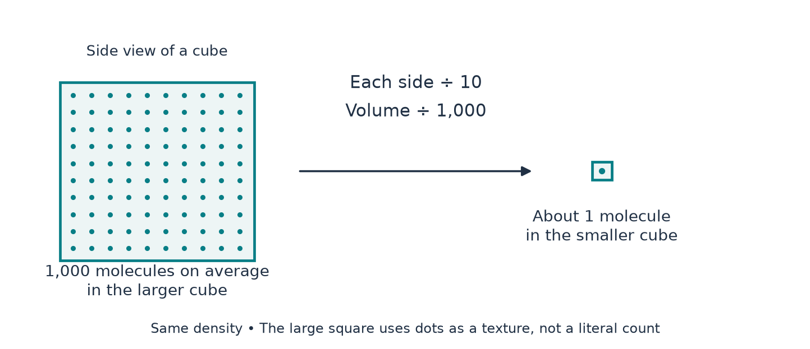

[Return to the paper map](../paper-map/article.html) · Physical interpretation, article 2 of 3

Imagine a painting that is one metre wide but contains lines a tenth of a millimetre apart. The canvas size does not tell you how fine a camera must be to resolve the lines.

A vortex has the same distinction. Its core radius measures the size of an intense region. Fine waves inside that region can vary over a much shorter distance.

This matters when asking whether a continuum fluid model has a physical interpretation. We need a ruler for the variation we want to describe, not just a ruler for the whole object.

## Compare the right lengths

A one-millimetre core might, in an illustrative scenario, contain changes over one micrometre. That is a thousand times smaller.

The overall radius may look comfortably large while the fine structure demands much smaller averaging regions.

The paper has several lengths: the core width, the axial extent, the width of a pulse envelope, and the spacing of the oscillation inside it. A further distinction is the distance over which velocity changes appreciably, which also depends on amplitude and direction.

We cannot replace all of these by “the vortex size.” Nor have our physical scale studies reconstructed the complete pulse wavelengths and gradients.

## An averaging box must be neither too large nor too small

To assign a local velocity, imagine averaging molecular motion in a small box.

If the box is too large, it blends different parts of the flow and erases the feature we wanted to describe. If it is too small, it contains too few molecules for the intended smooth average.

Suppose a box contains 1,000 molecules on average. Shrink each side by ten while holding the density fixed. Its volume is divided by 1,000, so its expected molecular count drops to one.

That is why a modest-looking change in the required linear resolution can cause a large change in molecular statistics.

{#fig-average fig-alt="A larger averaging cube labelled 1000 molecules is compared with a cube one tenth as wide labelled one molecule."}

The whole core may still contain many molecules. The question concerns the small regions needed to describe its local variations.

## Gas molecules bring another ruler

Between collisions, gas molecules travel a typical distance called the **mean free path**.

If the flow changes over a distance much larger than that path, a local continuum description has a useful separation of scales. If the two become comparable, molecules can cross significantly different conditions between collisions.

A common preliminary comparison is

$$
\text{length ratio}=
\frac{\text{mean free path}}
{\text{flow-variation length}}.
$$

This is the Knudsen number. For the stated room-temperature air reference, the mean free path is about **67 nanometres**. A variation length about one hundred times larger is approximately **6.7 micrometres**.

The corresponding ratio of 0.01 is often used as an engineering screen. It is not an exact universal boundary or proof that every continuum assumption holds below it.

## Speed and length ask different physical questions

Comparing speed with sound speed asks whether density changes may matter. Comparing molecular flight length with flow-variation length asks whether a local continuum description is appropriate.

Either concern can arise first, depending on the flow. If a fine ripple is much smaller than the core radius, the molecular-length screen can be reached earlier than a calculation using the core radius would suggest.

A gas can also remain a continuum while needing a **compressible** model. “Continuum” and “incompressible” are different assumptions, so they should not be treated as a single switch.

For a liquid, the gas mean-free-path picture is not directly transferable. Molecular spacing, correlations, relaxation, and thermodynamic state require their own treatment.

## Molecules also need time to respond

Lengths are only part of the story. The local state may change so quickly that molecules do not have enough time to establish the kind of local balance assumed by the model.

A rough flow time is “variation length divided by speed.” Shorten the distance or increase the speed and that time decreases.

Comparing it with a molecular response time is another useful question. Our gas calculations use a declared collision-time proxy. They do not establish a universal liquid response time or a physical realization of the paper's detailed field.

## What our regime map actually compares

The supporting study follows several assumed variation lengths along the same illustrative radius–speed curve. It asks how the order of the physical screening markers changes.

These are scenarios. The figure does not measure the actual smallest length in the paper's pulses. Its purpose is to expose the dependency that a single core-radius plot hides.

The physical discussion draws on the scalings in Sections 2–3 of the paper and the property/model references recorded in the [source notes](source-notes.md).

## Where this fits in the bigger picture

**A large object can contain structure too fine for the model used to describe it.** Physical interpretation therefore needs both the overall geometry and the actual variation scales.

This is a companion question about the meaning of the continuum construction, not another proof block. Continue with [what changes when gas density is allowed to vary](../d10_compressible_vortex/article.html), or return to the [paper map](../paper-map/article.html).

The [technical article](technical-article.html), [notebook](../../code/d9_regime_map/study.ipynb), and [source notes](source-notes.md) retain the scenario assumptions, units, and unresolved gradient scales.
