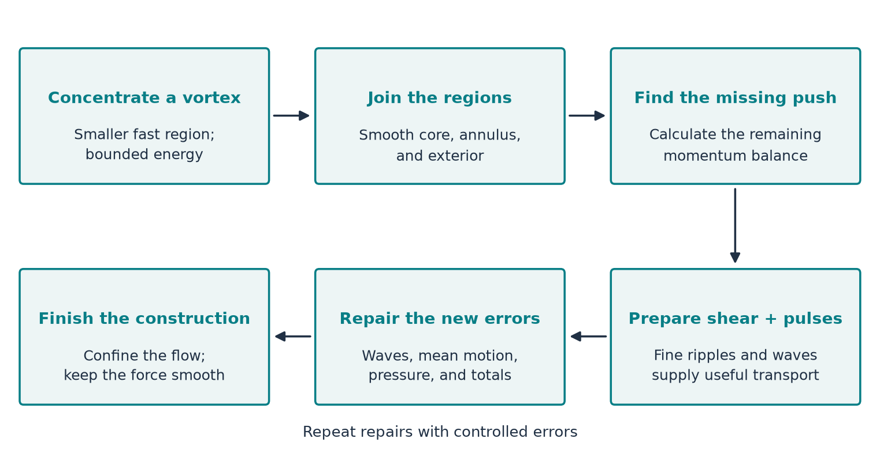

A long mathematical paper can feel like a box of LEGO pieces without the picture on the lid. You can inspect each piece and still have little idea what you are trying to build. This guide supplies that picture.

The paper describes a specially designed fluid motion that becomes faster and more concentrated as a particular time approaches. The challenge is to make that motion obey the fluid equations while the external force stays smooth. The many profiles, waves, corrections, and estimates all serve that goal.

You can follow the explanations here with arithmetic, graphs, areas, and the idea of a slope. When a more advanced concept appears, we explain its job before naming it. The calculations and original technical articles remain available at the end of each installment.

## The question in ordinary language

The Navier–Stokes equations describe how a viscous fluid moves. *Viscous* means that neighbouring regions moving at different speeds exchange momentum, tending to smooth out those differences.

The equations combine two ideas. First, fluid parcels accelerate according to the pushes they receive: pressure, viscosity, and an external force. Second, the incompressible model makes each moving parcel keep its volume. Fluid entering a small region must be balanced by fluid leaving it.

The paper's claimed result concerns a deliberately chosen **smooth external force**, acting on fluid initially at rest. The resulting velocity is smooth before the designated time, but its largest value becomes unbounded as that time approaches. The total kinetic energy stays bounded. This is a statement about the forced mathematical equations. [Paper, Theorem 1.1 and Sections 1–2](https://cdn.openai.com/pdf/32d9f210-8b73-45e0-91bc-82a30aef8a9a/navier-stokes.pdf)

“Blow-up” means that no finite number remains an upper limit on the speed. It does not mean that the whole fluid suddenly has infinite speed. Nor does this guide establish that a real liquid or gas could reach that limit. We are explaining the construction presented in the paper, not independently checking every proof.

## The picture on the box

Here is the whole strategy in one sentence:

**Design a shrinking vortex, calculate the push that its motion is missing, supply that push through carefully arranged small-scale motion, and control the errors so the external force stays smooth.**

{#fig-map fig-alt="Six connected blocks: concentrate a vortex; join core to exterior; identify missing transport; prepare shear and add pulses; repair remaining errors; localize the result and keep the force smooth."}

### Block 1: a fast motion in a shrinking region

A small amount of fluid can move extremely fast without making the total energy enormous. A simple calculation shows why: energy depends on speed squared **and** how much fluid moves at that speed.

The intense part of the proposed vortex shrinks in radius and length. The radius shrinks slightly faster, making the region increasingly slender. “The core” names this moving region of intense motion; it does not identify a fixed collection of molecules.

**Job in the argument:** make growing speed compatible with bounded energy. Start with [speed and energy](../d2_finite_energy/article.html). This is mainly Section 2.1, developed in Sections 3–4.

### Block 2: a core, a joining ring, and an exterior

The flow needs a smooth centre. Outside it, the motion must connect to a simpler outer flow. The ring-shaped joining region is called the *annulus*. Pressure also has to fit across the regions.

Think of building a bridge: an excellent central span is insufficient if its connections to the banks do not fit. Here the connections must satisfy fluid balances as well as match smoothly.

**Job in the argument:** provide a usable background vortex. Read [the smooth centre](../d6_inner_profile/article.html) and [pressure from the surrounding flow](../d6_axis_pressure/article.html). These explain parts of Section 4 and Appendices A–B.

### Block 3: find the missing push

Once a candidate velocity and pressure have been chosen, we can calculate the external force they would require. The paper calls this the *momentum residual*. It is a force-balance calculation.

The background vortex alone leaves a troublesome imbalance in its joining ring. Calling that imbalance an external force would not solve the problem: the force would have the wrong behaviour near the singular time.

**Job in the argument:** turn “this vortex is not yet a solution with a smooth force” into a precise repair target. Read [the missing-push calculation](../d3_residual/article.html). See Sections 2.2, 3.2 and 5.

### Block 4: use fine ripples to achieve what a coarse shape cannot

A line can look almost flat from far away while being steep on each tiny rising or falling segment. This separation between overall shape and local slope is one route into **convex integration**.

Appendix C uses a related construction: rapid radial variations improve the local shear—the difference between neighbouring velocities—while making only a small change to the overall profiles. Their averages are chosen carefully, and further adjustments restore the required totals.

**Job in the argument:** prepare a background whose missing transport can be supplied by the available waves. Read [convex integration, from slopes to fluid motion](../convex-integration/article.html). Appendix C belongs here in the story, even though it appears near the back of the paper.

### Block 5: make oscillations do useful work

Opposite velocity fluctuations can average to zero while their momentum transport does not. The reason is simple multiplication: reversing two signs leaves their product unchanged.

The paper chooses two pulse families whose combined transport supplies the required leading contribution. Their growth comes from the background shear. Later, shear squeezes their pattern into finer scales and viscosity damps them.

**Job in the argument:** let internal fluid motion supply the troublesome missing transport. Read [zero average, nonzero transport](../d4_mean_stress/article.html), then [why a pulse grows and fades](../d5_shearing_wave/article.html). These connect to Sections 6–7 and Appendix C.

### Block 6: repair the repairs, then finish the construction

Adding waves fixes one imbalance and creates others. Local adjustments can also change totals that matter outside their own neighbourhood. The construction repeatedly updates the waves, mean motion, pressure, and weighted totals.

Finally, the paper combines the corrections and confines the flow to a bounded region. It must preserve both the increasing velocity and the smoothness of the required external force.

**Job in the argument:** turn the mechanism into the claimed complete solution. Read [repairing weighted totals](../d6_moment_correction/article.html), then [from corrections to a complete flow](../completing-the-flow/article.html). These explain the roles of Sections 5, 8, 9 and 10.

## Where every section belongs

The order of a proof follows its dependencies. A first reading can instead follow the ideas.

| Paper location | What it does, in everyday language |
| --- | --- |
| Section 1 | States the target and relates it to earlier work. |
| Section 2 | Describes the vortex, the pulses, and the physical mechanism. |
| Section 3 | Gives the plan of the construction before the full details. |
| Section 4 | Builds the basic vortex and specifies what the joining ring must do. |
| Section 5 | Adds finer background corrections for balances omitted at first. |
| Section 6 | Organizes the oscillations so distinct pulses do not create unwanted overlap terms. |
| Section 7 | Builds growing and decaying pulses and chooses their averaged transport. |
| Section 8 | Repairs mean motion, pressure compatibility, and weighted totals locally. |
| Section 9 | Repeats the repairs, controls new errors, and combines the stages. |
| Section 10 | Starts from rest, confines the construction, extends the force smoothly, and completes the argument. |
| Appendix A | Prepares radial schedules, matching totals, and the outer flow. |
| Appendix B | Builds a smooth inner profile and connects it outward. |
| Appendix C | Uses rapid shear variations and total-preserving repairs to make the wave requirements fit. |

The [paper's contents and proof-outline figures](https://cdn.openai.com/pdf/32d9f210-8b73-45e0-91bc-82a30aef8a9a/navier-stokes.pdf#page=13) are the source for this map. Our examples illustrate the jobs performed by these blocks; they are not substitutes for their proofs.

## A first reading route

Follow these nine articles in order. Each introduces the concepts it uses and ends by returning to the paper.

1. [How can speed rise while energy falls?](../d2_finite_energy/article.html)
2. [What should happen at the centre of a vortex?](../d6_inner_profile/article.html)
3. [Why the pressure at the centre depends on the outside](../d6_axis_pressure/article.html)
4. [The missing push: what a residual means](../d3_residual/article.html)
5. [Convex integration: useful fine detail](../convex-integration/article.html)
6. [How motion with zero average can transport momentum](../d4_mean_stress/article.html)
7. [How a small wave grows, then fades](../d5_shearing_wave/article.html)
8. [How small local repairs preserve important totals](../d6_moment_correction/article.html)
9. [How the pieces become one complete flow](../completing-the-flow/article.html)

For a first pass, the numerical side articles are optional: [local checks versus global guarantees](../d6_global_axis/article.html) and [what computer digits can hide](../d7_conditioning/article.html).

The physical interpretation has its own short route: [core size versus speed](../d1_core_size/article.html), [which small length matters](../d9_regime_map/article.html), and [what changes when density can vary](../d10_compressible_vortex/article.html). These ask what the model can mean for matter; they are not additional proof steps.

## A small vocabulary to keep nearby

| Word | Meaning in this guide |
| --- | --- |
| Profile | The shape of a quantity as position changes. |
| Shear | Neighbouring fluid moving at different speeds. |
| Oscillation | A repeated variation, such as a wave or a ripple. |
| Momentum | Mass times velocity; both amount and direction matter. |
| Stress | Momentum transport, or the corresponding force-per-area description. |
| Residual | The force required by a proposed velocity and pressure; compared with a specified force, it reveals the remaining mismatch. |
| Mean | An average over a stated group, region, or wave cycle. |
| Moment | A total in which contributions receive specified weights. |
| Smooth | Having well-behaved rates of change of every order used by the theorem. |
| Localization | Making a field vanish outside a chosen region, with a smooth transition. |

## What understanding the paper should feel like

You do not need to remember every symbol. You should be able to say what problem each block solves, why that problem appears, and what the next block needs from it.

The central thread is the balance between a growing velocity and a well-behaved force. The shrinking geometry makes the energy possible; the background establishes the shape; the ripples and pulses provide the missing transport; the corrections and final estimates make the pieces fit.

